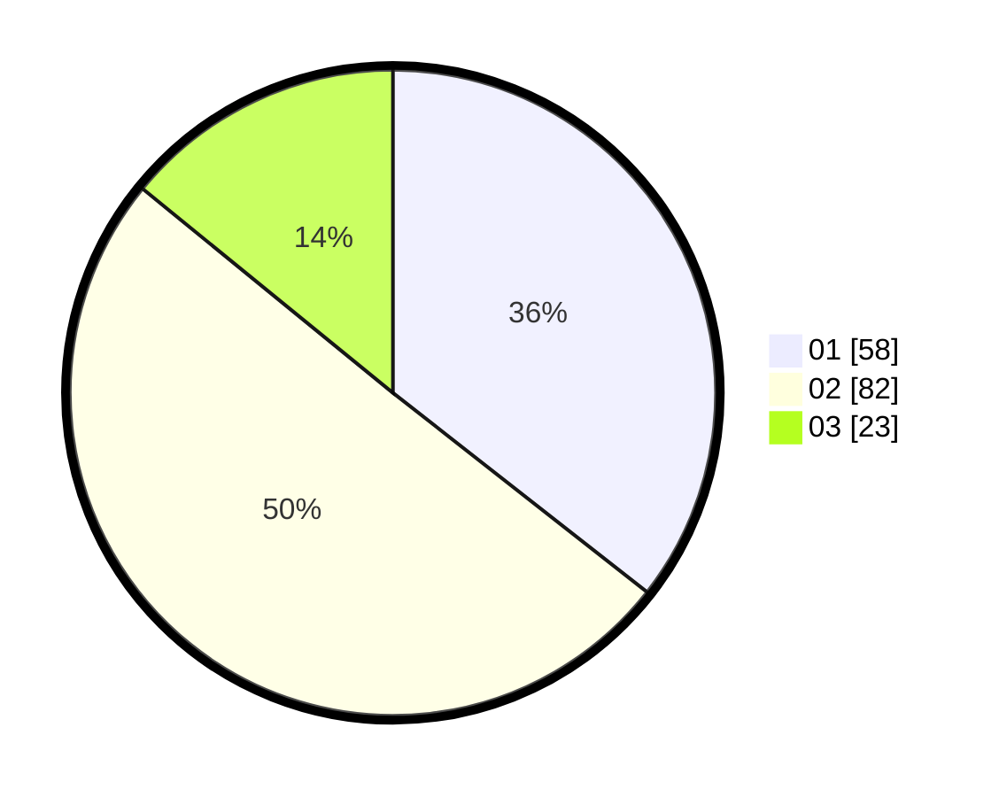

# Hasil

Hasil perolehan suara paslon dapat dilihat pada file paslon-01.txt, paslon-02.txt, dan paslon-03.txt.

Jika tidak ada, artinya data tersebut belum ada pada SIREKAP.

## Perolehan Suara

 * Paslon 01: **58**.
 * Paslon 02: **82**.
 * Paslon 03: **23**.

## Foto C Plano

https://sirekap-obj-formc.kpu.go.id/9968/pemilu/ppwp/31/75/06/10/05/3175061005337-20240215-055512--3d796b3e-fab7-44e6-b224-0df7bf4b26cf.jpg

https://sirekap-obj-formc.kpu.go.id/9968/pemilu/ppwp/31/75/06/10/05/3175061005337-20240215-055513--20418051-f1df-410f-a129-48b6a9c28e76.jpg

https://sirekap-obj-formc.kpu.go.id/9968/pemilu/ppwp/31/75/06/10/05/3175061005337-20240215-055512--2e8f8774-755a-4efc-9f05-5b0d65a1921c.jpg

## DATA PEMILIH TETAP

Jumlah pemilih dalam DPT: **202**.
 * L: **101**.
 * P: **101**.

## DATA PENGGUNA HAK PILIH

Jumlah pengguna hak pilih dalam DPT: **164**.
 * L: **80**.
 * P: **84**.

Jumlah pengguna hak pilih dalam DPTb: **0**.
 * L: **0**.
 * P: **0**.

Jumlah pengguna hak pilih dalam DPK: **2**.
 * L: **1**.
 * P: **1**.

Jumlah pengguna hak pilih: **166**.
 * L: **81**.
 * P: **85**.

## JUMLAH SUARA SAH DAN TIDAK SAH

JUMLAH SELURUH SUARA SAH: **163**.

JUMLAH SUARA TIDAK SAH: **3**.

JUMLAH SELURUH SUARA SAH DAN SUARA TIDAK SAH: **166**.
