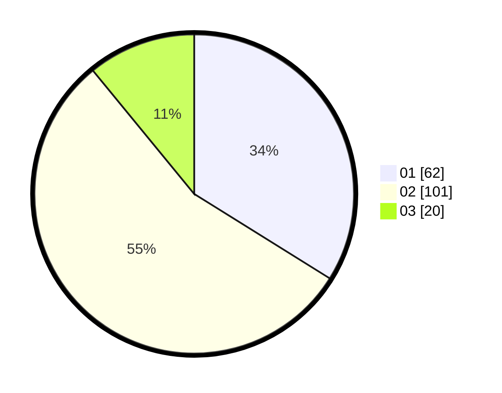

# Hasil

Hasil perolehan suara paslon dapat dilihat pada file paslon-01.txt, paslon-02.txt, dan paslon-03.txt.

Jika tidak ada, artinya data tersebut belum ada pada SIREKAP.

## Perolehan Suara

 * Paslon 01: **62**.
 * Paslon 02: **101**.
 * Paslon 03: **20**.

## Foto C Plano

https://sirekap-obj-formc.kpu.go.id/88b8/pemilu/ppwp/31/75/06/10/05/3175061005341-20240214-235211--9ebf4f3f-70d6-4b59-8fe5-34a67f5b59ba.jpg

https://sirekap-obj-formc.kpu.go.id/88b8/pemilu/ppwp/31/75/06/10/05/3175061005341-20240214-235435--0fe1befa-be35-49fa-9452-93138034f3ee.jpg

https://sirekap-obj-formc.kpu.go.id/88b8/pemilu/ppwp/31/75/06/10/05/3175061005341-20240215-021054--8fc8cc25-68e3-4dfa-8225-31e45f27f247.jpg
