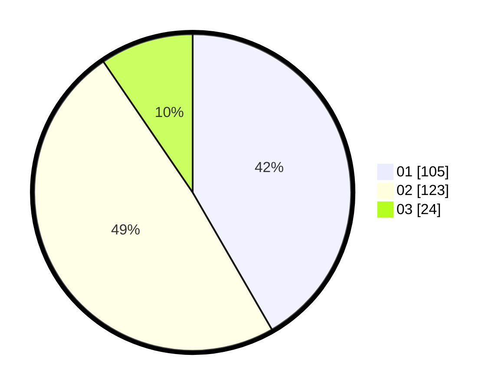

# Hasil

Hasil perolehan suara paslon dapat dilihat pada file paslon-01.txt, paslon-02.txt, dan paslon-03.txt.

Jika tidak ada, artinya data tersebut belum ada pada SIREKAP.

## Perolehan Suara

 * Paslon 01: **105**.
 * Paslon 02: **123**.
 * Paslon 03: **24**.

## Foto C Plano

https://sirekap-obj-formc.kpu.go.id/759c/pemilu/ppwp/31/75/06/10/05/3175061005344-20240214-221948--b6fe5183-f1e8-40d6-8051-39b2e58866ac.jpg

https://sirekap-obj-formc.kpu.go.id/759c/pemilu/ppwp/31/75/06/10/05/3175061005344-20240214-222134--d22ecbcd-c7b1-41b0-bb37-e126c9388193.jpg

https://sirekap-obj-formc.kpu.go.id/759c/pemilu/ppwp/31/75/06/10/05/3175061005344-20240214-222213--05be86f9-fcf3-479c-9fac-a087ba9ae197.jpg
