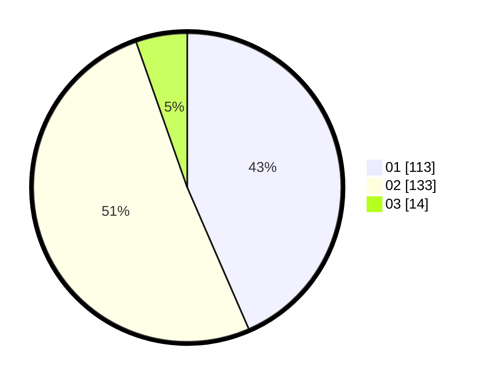

# Hasil

Hasil perolehan suara paslon dapat dilihat pada file paslon-01.txt, paslon-02.txt, dan paslon-03.txt.

Jika tidak ada, artinya data tersebut belum ada pada SIREKAP.

## Perolehan Suara

 * Paslon 01: **113**.
 * Paslon 02: **133**.
 * Paslon 03: **14**.

## Foto C Plano

https://sirekap-obj-formc.kpu.go.id/3403/pemilu/ppwp/31/75/06/10/05/3175061005346-20240214-193735--933966fa-91e0-4b70-80c7-d9cfabdbf459.jpg

https://sirekap-obj-formc.kpu.go.id/3403/pemilu/ppwp/31/75/06/10/05/3175061005346-20240214-193913--f7755990-992f-4dd9-a288-0dbd987ebf63.jpg

https://sirekap-obj-formc.kpu.go.id/3403/pemilu/ppwp/31/75/06/10/05/3175061005346-20240214-194110--44ad4c2c-1817-4d81-b70b-1c56520d3592.jpg
