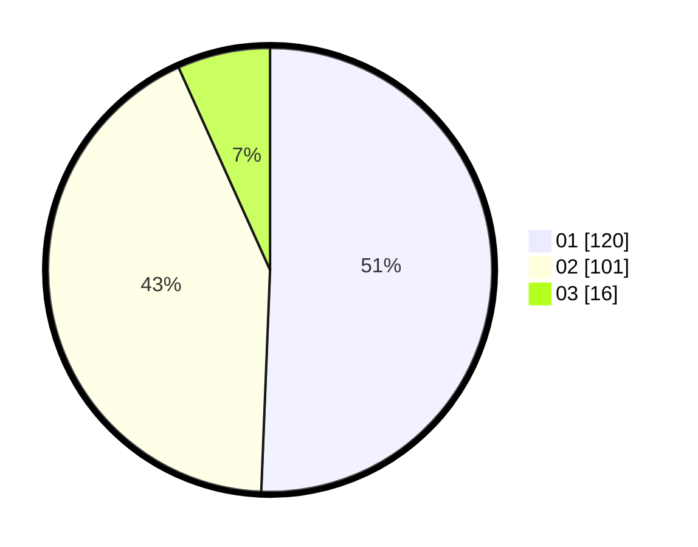

# Hasil

Hasil perolehan suara paslon dapat dilihat pada file paslon-01.txt, paslon-02.txt, dan paslon-03.txt.

Jika tidak ada, artinya data tersebut belum ada pada SIREKAP.

## Perolehan Suara

 * Paslon 01: **120**.
 * Paslon 02: **101**.
 * Paslon 03: **16**.

## Foto C Plano

https://sirekap-obj-formc.kpu.go.id/3dc3/pemilu/ppwp/31/75/06/10/05/3175061005350-20240214-221848--d6af6040-6d9e-406e-864e-582cd1c25e6e.jpg

https://sirekap-obj-formc.kpu.go.id/3dc3/pemilu/ppwp/31/75/06/10/05/3175061005350-20240214-232028--0740997a-a51f-4b32-97f9-b07c06e267ad.jpg

https://sirekap-obj-formc.kpu.go.id/3dc3/pemilu/ppwp/31/75/06/10/05/3175061005350-20240214-232128--eb7ab08c-7099-4481-98ce-5849ed488711.jpg
