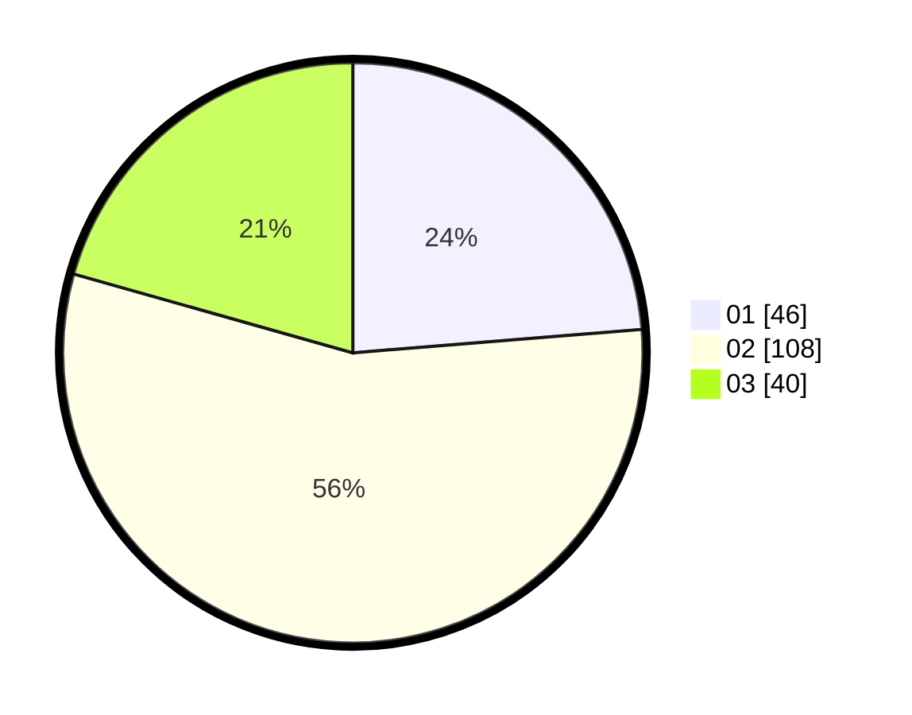

# Hasil

Hasil perolehan suara paslon dapat dilihat pada file paslon-01.txt, paslon-02.txt, dan paslon-03.txt.

Jika tidak ada, artinya data tersebut belum ada pada SIREKAP.

## Perolehan Suara

 * Paslon 01: **46**.
 * Paslon 02: **108**.
 * Paslon 03: **40**.

## Foto C Plano

https://sirekap-obj-formc.kpu.go.id/ff0a/pemilu/ppwp/31/75/06/10/06/3175061006009-20240214-222933--a6a002d2-cd29-49ed-a6ab-0de3030c0a14.jpg

https://sirekap-obj-formc.kpu.go.id/ff0a/pemilu/ppwp/31/75/06/10/06/3175061006009-20240214-202656--6679096e-8353-4aff-9cb7-19ba3d5ea8b2.jpg

https://sirekap-obj-formc.kpu.go.id/ff0a/pemilu/ppwp/31/75/06/10/06/3175061006009-20240214-202804--8353c43c-4bb3-42c2-a48a-0619608afb02.jpg

## DATA PEMILIH TETAP

Jumlah pemilih dalam DPT: **283**.
 * L: **143**.
 * P: **140**.

## DATA PENGGUNA HAK PILIH

Jumlah pengguna hak pilih dalam DPT: **188**.
 * L: **92**.
 * P: **96**.

Jumlah pengguna hak pilih dalam DPTb: **5**.
 * L: **3**.
 * P: **2**.

Jumlah pengguna hak pilih dalam DPK: **1**.
 * L: **1**.
 * P: **0**.

Jumlah pengguna hak pilih: **194**.
 * L: **96**.
 * P: **98**.

## JUMLAH SUARA SAH DAN TIDAK SAH

JUMLAH SELURUH SUARA SAH: **194**.

JUMLAH SUARA TIDAK SAH: **0**.

JUMLAH SELURUH SUARA SAH DAN SUARA TIDAK SAH: **194**.
