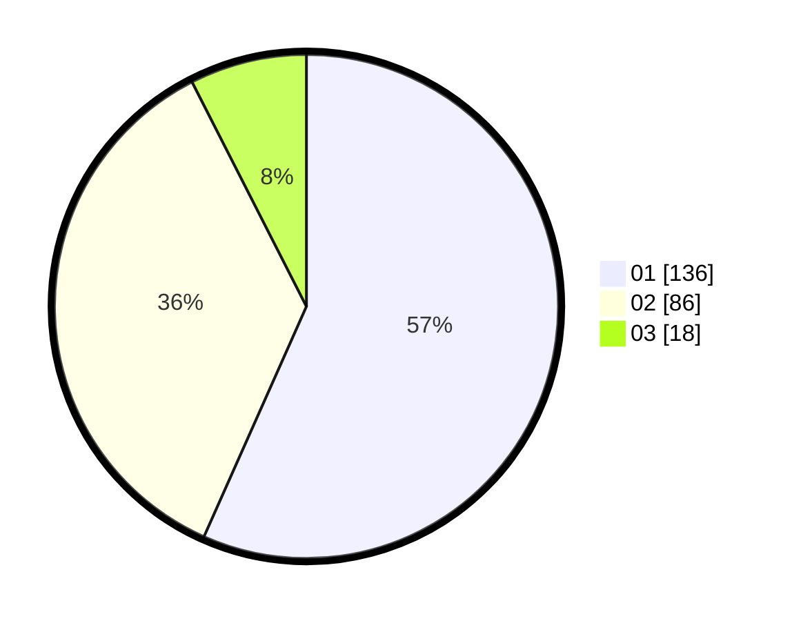

# Hasil

Hasil perolehan suara paslon dapat dilihat pada file paslon-01.txt, paslon-02.txt, dan paslon-03.txt.

Jika tidak ada, artinya data tersebut belum ada pada SIREKAP.

## Perolehan Suara

 * Paslon 01: **136**.
 * Paslon 02: **86**.
 * Paslon 03: **18**.

## Foto C Plano

https://sirekap-obj-formc.kpu.go.id/c6a2/pemilu/ppwp/31/75/06/10/06/3175061006023-20240214-155154--2a6e5904-93ee-4eb5-8675-fb720da1f27d.jpg

https://sirekap-obj-formc.kpu.go.id/c6a2/pemilu/ppwp/31/75/06/10/06/3175061006023-20240214-155519--0831c9db-0f75-4afb-b89b-7ded297cf2a5.jpg

https://sirekap-obj-formc.kpu.go.id/c6a2/pemilu/ppwp/31/75/06/10/06/3175061006023-20240214-155639--b6198894-7053-41ff-a004-9570256e2fa7.jpg

## DATA PEMILIH TETAP

Jumlah pemilih dalam DPT: **287**.
 * L: **142**.
 * P: **145**.

## DATA PENGGUNA HAK PILIH

Jumlah pengguna hak pilih dalam DPT: **230**.
 * L: **111**.
 * P: **119**.

Jumlah pengguna hak pilih dalam DPTb: **3**.
 * L: **1**.
 * P: **2**.

Jumlah pengguna hak pilih dalam DPK: **3**.
 * L: **2**.
 * P: **1**.

Jumlah pengguna hak pilih: **236**.
 * L: **114**.
 * P: **122**.

## JUMLAH SUARA SAH DAN TIDAK SAH

JUMLAH SELURUH SUARA SAH: **240**.

JUMLAH SUARA TIDAK SAH: **1**.

JUMLAH SELURUH SUARA SAH DAN SUARA TIDAK SAH: **241**.
