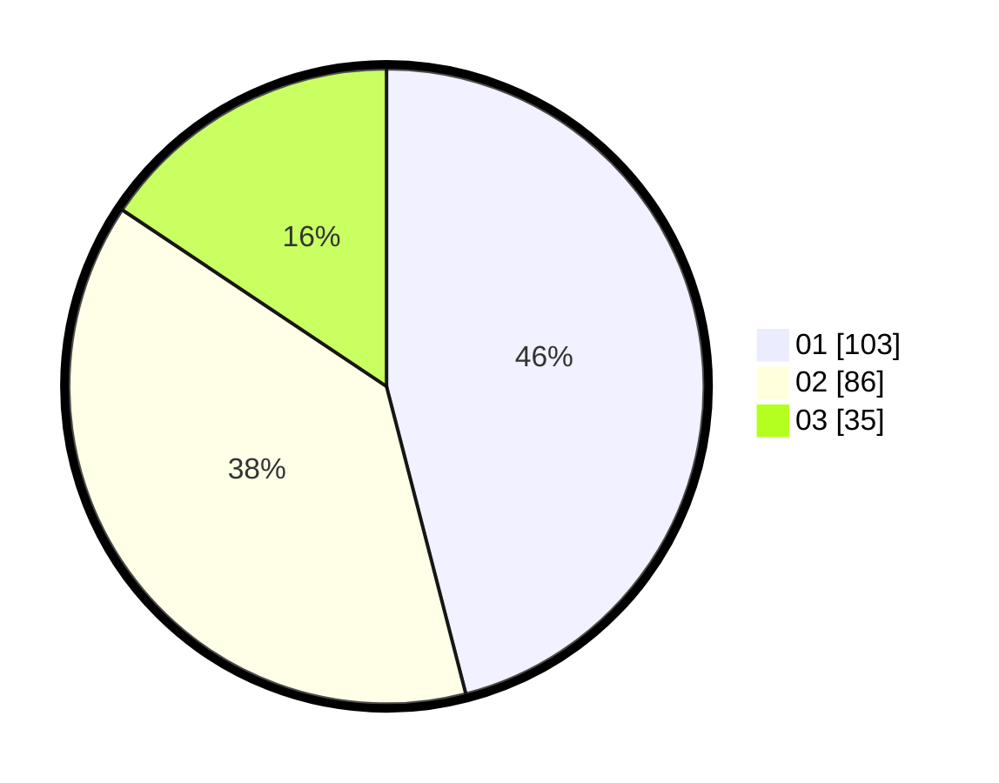

# Hasil

Hasil perolehan suara paslon dapat dilihat pada file paslon-01.txt, paslon-02.txt, dan paslon-03.txt.

Jika tidak ada, artinya data tersebut belum ada pada SIREKAP.

## Perolehan Suara

 * Paslon 01: **103**.
 * Paslon 02: **86**.
 * Paslon 03: **35**.

## Foto C Plano

https://sirekap-obj-formc.kpu.go.id/b6d0/pemilu/ppwp/31/75/06/10/06/3175061006027-20240214-192152--65ffa3e8-cc88-4d54-b1f4-4c1d571cb56c.jpg

https://sirekap-obj-formc.kpu.go.id/b6d0/pemilu/ppwp/31/75/06/10/06/3175061006027-20240214-192438--0572f818-1ab7-43f7-b622-ecd2d5c5aac7.jpg

https://sirekap-obj-formc.kpu.go.id/b6d0/pemilu/ppwp/31/75/06/10/06/3175061006027-20240214-192601--304949b0-3ec9-4b14-9775-0be5fdc2e031.jpg

## DATA PEMILIH TETAP

Jumlah pemilih dalam DPT: **286**.
 * L: **141**.
 * P: **145**.

## DATA PENGGUNA HAK PILIH

Jumlah pengguna hak pilih dalam DPT: **220**.
 * L: **104**.
 * P: **116**.

Jumlah pengguna hak pilih dalam DPTb: **7**.
 * L: **3**.
 * P: **4**.

Jumlah pengguna hak pilih dalam DPK: **0**.
 * L: **0**.
 * P: **0**.

Jumlah pengguna hak pilih: **227**.
 * L: **107**.
 * P: **120**.

## JUMLAH SUARA SAH DAN TIDAK SAH

JUMLAH SELURUH SUARA SAH: **224**.

JUMLAH SUARA TIDAK SAH: **3**.

JUMLAH SELURUH SUARA SAH DAN SUARA TIDAK SAH: **227**.
