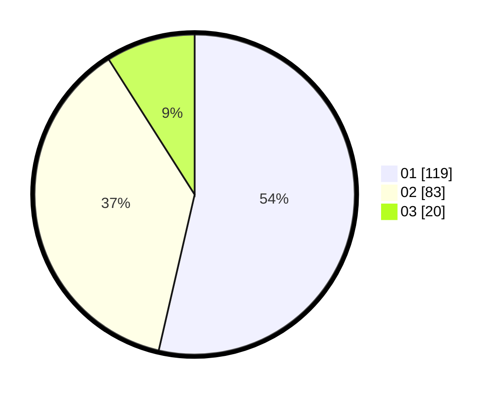

# Hasil

Hasil perolehan suara paslon dapat dilihat pada file paslon-01.txt, paslon-02.txt, dan paslon-03.txt.

Jika tidak ada, artinya data tersebut belum ada pada SIREKAP.

## Perolehan Suara

 * Paslon 01: **119**.
 * Paslon 02: **83**.
 * Paslon 03: **20**.

## Foto C Plano

https://sirekap-obj-formc.kpu.go.id/00d4/pemilu/ppwp/31/75/06/10/06/3175061006041-20240214-221843--97ec1daa-8e0e-44d0-b5ab-e7f79c1d131d.jpg

https://sirekap-obj-formc.kpu.go.id/00d4/pemilu/ppwp/31/75/06/10/06/3175061006041-20240214-222246--e5fadd17-d282-4dc6-a9e9-bb8a637fd72c.jpg

https://sirekap-obj-formc.kpu.go.id/00d4/pemilu/ppwp/31/75/06/10/06/3175061006041-20240214-222841--a550ac05-e663-4067-9613-7a4a2cc2d6af.jpg

## DATA PEMILIH TETAP

Jumlah pemilih dalam DPT: **258**.
 * L: **128**.
 * P: **130**.

## DATA PENGGUNA HAK PILIH

Jumlah pengguna hak pilih dalam DPT: **212**.
 * L: **108**.
 * P: **104**.

Jumlah pengguna hak pilih dalam DPTb: **6**.
 * L: **4**.
 * P: **2**.

Jumlah pengguna hak pilih dalam DPK: **4**.
 * L: **2**.
 * P: **2**.

Jumlah pengguna hak pilih: **222**.
 * L: **114**.
 * P: **108**.

## JUMLAH SUARA SAH DAN TIDAK SAH

JUMLAH SELURUH SUARA SAH: **222**.

JUMLAH SUARA TIDAK SAH: **0**.

JUMLAH SELURUH SUARA SAH DAN SUARA TIDAK SAH: **222**.
