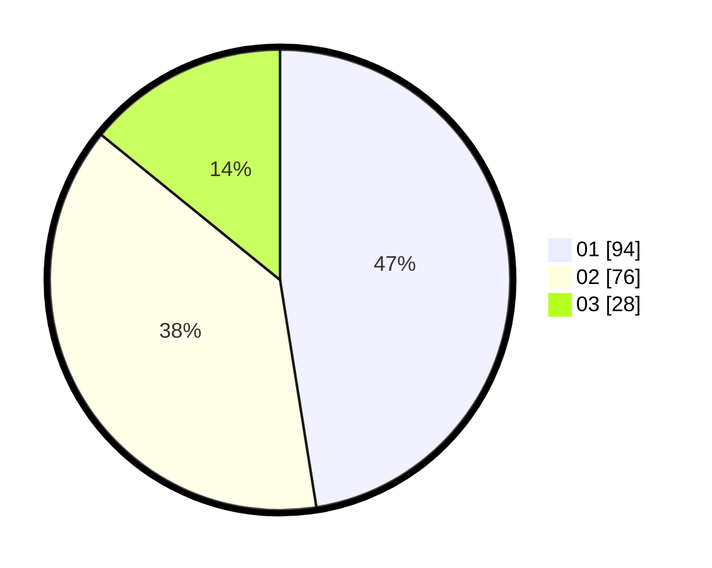

# Hasil

Hasil perolehan suara paslon dapat dilihat pada file paslon-01.txt, paslon-02.txt, dan paslon-03.txt.

Jika tidak ada, artinya data tersebut belum ada pada SIREKAP.

## Perolehan Suara

 * Paslon 01: **94**.
 * Paslon 02: **76**.
 * Paslon 03: **28**.

## Foto C Plano

https://sirekap-obj-formc.kpu.go.id/b0cc/pemilu/ppwp/31/75/06/10/06/3175061006053-20240214-215157--ffaf7368-bb24-479d-aa3e-6dd719b1a3df.jpg

https://sirekap-obj-formc.kpu.go.id/b0cc/pemilu/ppwp/31/75/06/10/06/3175061006053-20240214-200054--52c70969-8d42-4c70-a1d4-e711f34d1735.jpg

https://sirekap-obj-formc.kpu.go.id/b0cc/pemilu/ppwp/31/75/06/10/06/3175061006053-20240214-222016--dea11576-a21d-4ece-ae06-ed14b60712b7.jpg
