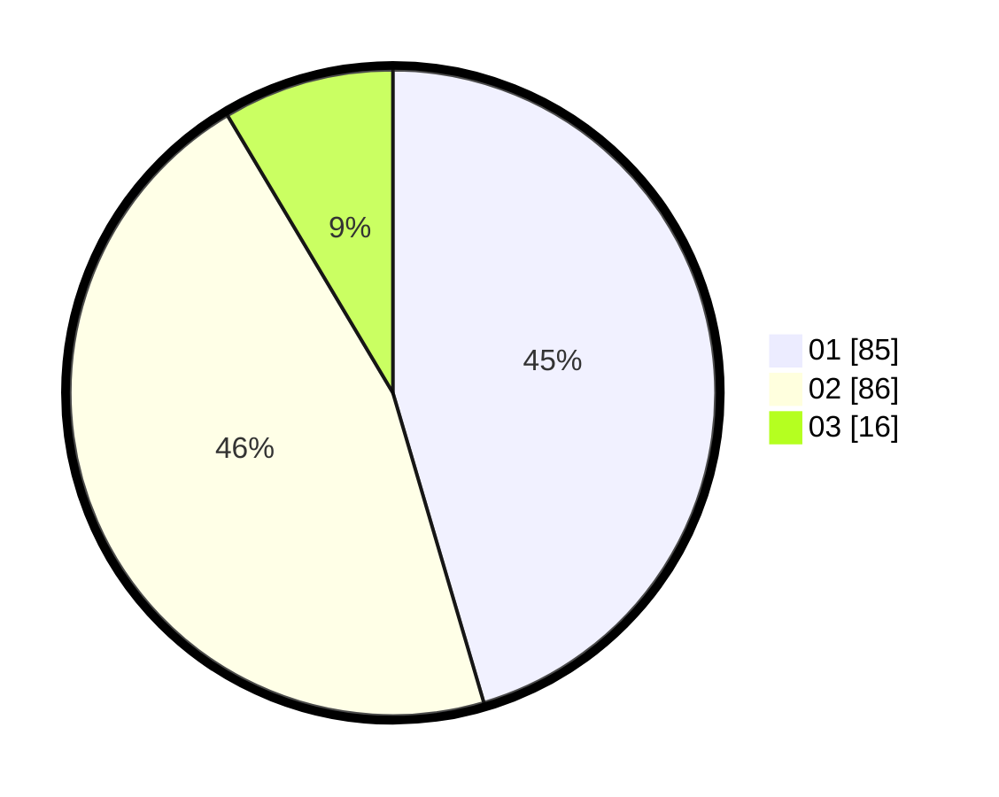

# Hasil

Hasil perolehan suara paslon dapat dilihat pada file paslon-01.txt, paslon-02.txt, dan paslon-03.txt.

Jika tidak ada, artinya data tersebut belum ada pada SIREKAP.

## Perolehan Suara

 * Paslon 01: **85**.
 * Paslon 02: **86**.
 * Paslon 03: **16**.

## Foto C Plano

https://sirekap-obj-formc.kpu.go.id/401e/pemilu/ppwp/31/75/06/10/06/3175061006072-20240215-235741--815b18bf-f768-4760-951b-6d21ec837e9a.jpg

https://sirekap-obj-formc.kpu.go.id/401e/pemilu/ppwp/31/75/06/10/06/3175061006072-20240214-205716--19a0e8d4-5b26-4fa8-a391-c52d7338a1bb.jpg

https://sirekap-obj-formc.kpu.go.id/401e/pemilu/ppwp/31/75/06/10/06/3175061006072-20240215-235742--5671504f-9d24-41d9-a513-7f0bcda2cd3d.jpg

## DATA PEMILIH TETAP

Jumlah pemilih dalam DPT: **280**.
 * L: **150**.
 * P: **130**.

## DATA PENGGUNA HAK PILIH

Jumlah pengguna hak pilih dalam DPT: **183**.
 * L: **90**.
 * P: **93**.

Jumlah pengguna hak pilih dalam DPTb: **2**.
 * L: **1**.
 * P: **1**.

Jumlah pengguna hak pilih dalam DPK: **4**.
 * L: **3**.
 * P: **1**.

Jumlah pengguna hak pilih: **189**.
 * L: **94**.
 * P: **95**.

## JUMLAH SUARA SAH DAN TIDAK SAH

JUMLAH SELURUH SUARA SAH: **187**.

JUMLAH SUARA TIDAK SAH: **2**.

JUMLAH SELURUH SUARA SAH DAN SUARA TIDAK SAH: **189**.
