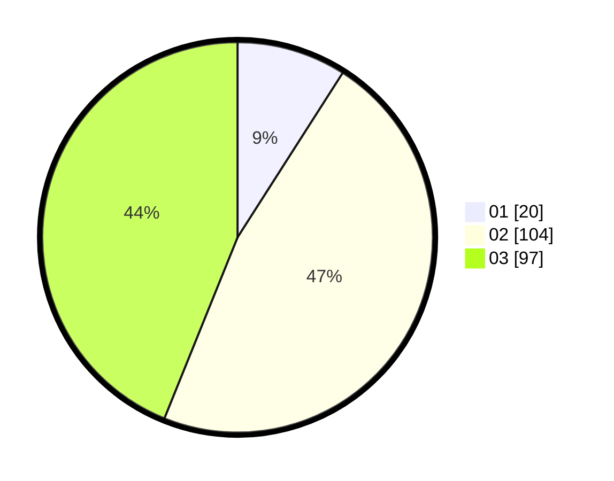

# Hasil

Hasil perolehan suara paslon dapat dilihat pada file paslon-01.txt, paslon-02.txt, dan paslon-03.txt.

Jika tidak ada, artinya data tersebut belum ada pada SIREKAP.

## Perolehan Suara

 * Paslon 01: **20**.
 * Paslon 02: **104**.
 * Paslon 03: **97**.

## Foto C Plano

https://sirekap-obj-formc.kpu.go.id/153b/pemilu/ppwp/31/75/06/10/06/3175061006073-20240214-155053--2cd0a9f9-7280-42af-97ea-a2a7a1aaac36.jpg

https://sirekap-obj-formc.kpu.go.id/153b/pemilu/ppwp/31/75/06/10/06/3175061006073-20240214-155010--1c4f2f65-7f0d-4d2e-9678-fb45787c7e61.jpg

https://sirekap-obj-formc.kpu.go.id/153b/pemilu/ppwp/31/75/06/10/06/3175061006073-20240214-155127--f43f08b2-ad50-4e8a-8499-74b1583ddeec.jpg

## DATA PEMILIH TETAP

Jumlah pemilih dalam DPT: **263**.
 * L: **131**.
 * P: **132**.

## DATA PENGGUNA HAK PILIH

Jumlah pengguna hak pilih dalam DPT: **206**.
 * L: **105**.
 * P: **101**.

Jumlah pengguna hak pilih dalam DPTb: **15**.
 * L: **6**.
 * P: **9**.

Jumlah pengguna hak pilih dalam DPK: **1**.
 * L: **1**.
 * P: **0**.

Jumlah pengguna hak pilih: **222**.
 * L: **112**.
 * P: **110**.

## JUMLAH SUARA SAH DAN TIDAK SAH

JUMLAH SELURUH SUARA SAH: **221**.

JUMLAH SUARA TIDAK SAH: **1**.

JUMLAH SELURUH SUARA SAH DAN SUARA TIDAK SAH: **222**.
