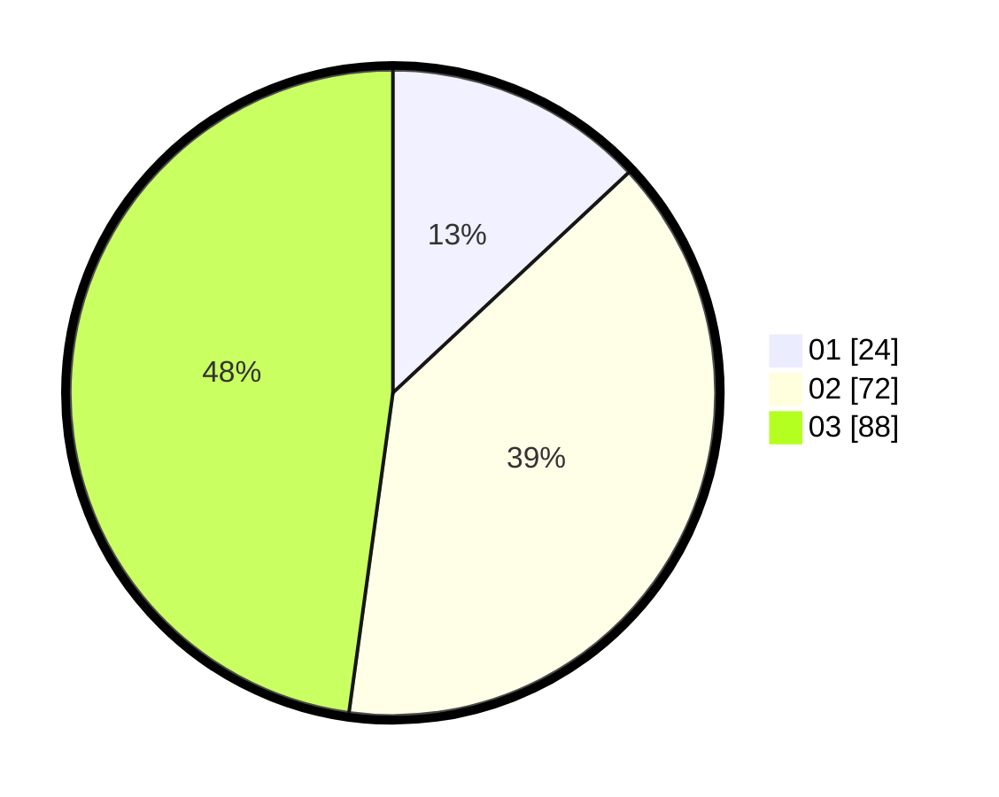

# Hasil

Hasil perolehan suara paslon dapat dilihat pada file paslon-01.txt, paslon-02.txt, dan paslon-03.txt.

Jika tidak ada, artinya data tersebut belum ada pada SIREKAP.

## Perolehan Suara

 * Paslon 01: **24**.
 * Paslon 02: **72**.
 * Paslon 03: **88**.

## Foto C Plano

https://sirekap-obj-formc.kpu.go.id/e08a/pemilu/ppwp/31/75/06/10/06/3175061006077-20240215-225213--aa0d3dd0-a933-4962-a48b-1fddfbe3266d.jpg

https://sirekap-obj-formc.kpu.go.id/e08a/pemilu/ppwp/31/75/06/10/06/3175061006077-20240215-225216--a0d1d57e-0c8a-4085-97a7-56cfddcd4f88.jpg

https://sirekap-obj-formc.kpu.go.id/e08a/pemilu/ppwp/31/75/06/10/06/3175061006077-20240216-005201--d095d002-de34-4da7-a145-78a42e0edac3.jpg

## DATA PEMILIH TETAP

Jumlah pemilih dalam DPT: **261**.
 * L: **127**.
 * P: **134**.

## DATA PENGGUNA HAK PILIH

Jumlah pengguna hak pilih dalam DPT: **183**.
 * L: **87**.
 * P: **96**.

Jumlah pengguna hak pilih dalam DPTb: **3**.
 * L: **0**.
 * P: **3**.

Jumlah pengguna hak pilih dalam DPK: **0**.
 * L: **0**.
 * P: **0**.

Jumlah pengguna hak pilih: **186**.
 * L: **87**.
 * P: **99**.

## JUMLAH SUARA SAH DAN TIDAK SAH

JUMLAH SELURUH SUARA SAH: **184**.

JUMLAH SUARA TIDAK SAH: **2**.

JUMLAH SELURUH SUARA SAH DAN SUARA TIDAK SAH: **186**.
