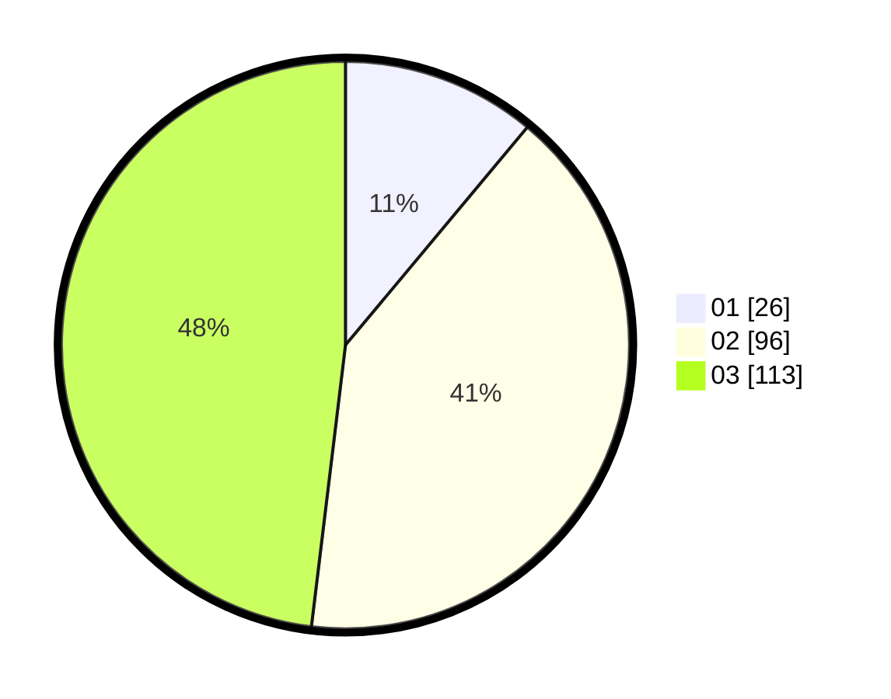

# Hasil

Hasil perolehan suara paslon dapat dilihat pada file paslon-01.txt, paslon-02.txt, dan paslon-03.txt.

Jika tidak ada, artinya data tersebut belum ada pada SIREKAP.

## Perolehan Suara

 * Paslon 01: **26**.
 * Paslon 02: **96**.
 * Paslon 03: **113**.

## Foto C Plano

https://sirekap-obj-formc.kpu.go.id/029d/pemilu/ppwp/31/75/06/10/06/3175061006081-20240215-010356--634537fb-4fc6-45b9-a111-34eba223d035.jpg

https://sirekap-obj-formc.kpu.go.id/029d/pemilu/ppwp/31/75/06/10/06/3175061006081-20240215-010503--2cdd5a02-59c0-4bba-90e1-a86c1847d03a.jpg

https://sirekap-obj-formc.kpu.go.id/029d/pemilu/ppwp/31/75/06/10/06/3175061006081-20240215-010621--c365005b-9cb0-463b-9b11-e8f87cd9c2f6.jpg

## DATA PEMILIH TETAP

Jumlah pemilih dalam DPT: **286**.
 * L: **139**.
 * P: **147**.

## DATA PENGGUNA HAK PILIH

Jumlah pengguna hak pilih dalam DPT: **226**.
 * L: **106**.
 * P: **120**.

Jumlah pengguna hak pilih dalam DPTb: **7**.
 * L: **3**.
 * P: **4**.

Jumlah pengguna hak pilih dalam DPK: **4**.
 * L: **2**.
 * P: **2**.

Jumlah pengguna hak pilih: **237**.
 * L: **111**.
 * P: **126**.

## JUMLAH SUARA SAH DAN TIDAK SAH

JUMLAH SELURUH SUARA SAH: **235**.

JUMLAH SUARA TIDAK SAH: **2**.

JUMLAH SELURUH SUARA SAH DAN SUARA TIDAK SAH: **237**.
