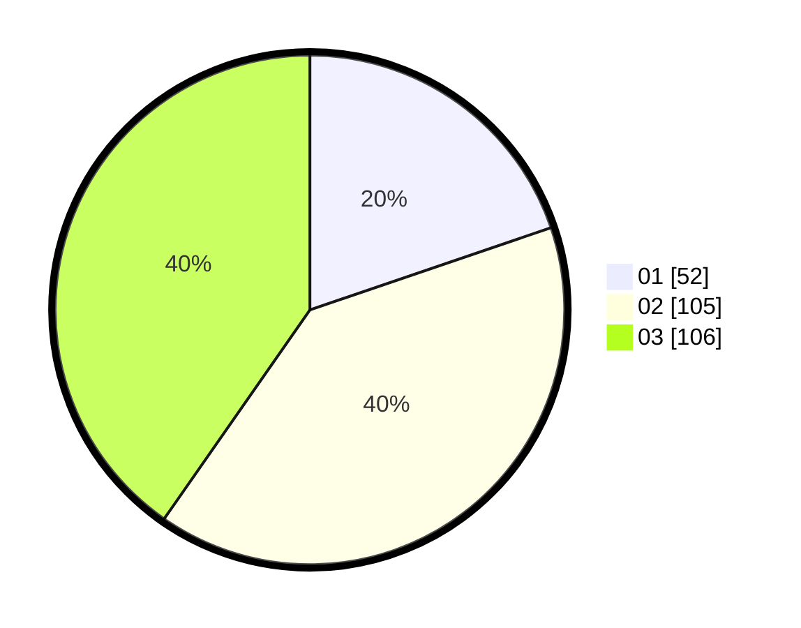

# Hasil

Hasil perolehan suara paslon dapat dilihat pada file paslon-01.txt, paslon-02.txt, dan paslon-03.txt.

Jika tidak ada, artinya data tersebut belum ada pada SIREKAP.

## Perolehan Suara

 * Paslon 01: **52**.
 * Paslon 02: **105**.
 * Paslon 03: **106**.

## Foto C Plano

https://sirekap-obj-formc.kpu.go.id/4cde/pemilu/ppwp/31/75/06/10/06/3175061006084-20240215-001524--1dc063aa-5d10-4c2a-a121-81b99c90f87f.jpg

https://sirekap-obj-formc.kpu.go.id/4cde/pemilu/ppwp/31/75/06/10/06/3175061006084-20240215-002629--143fec7c-3865-4afc-b60e-a7f713e86769.jpg

https://sirekap-obj-formc.kpu.go.id/4cde/pemilu/ppwp/31/75/06/10/06/3175061006084-20240215-002943--4f451234-dd1d-4a35-abd0-5e7a7693b51d.jpg

## DATA PEMILIH TETAP

Jumlah pemilih dalam DPT: **289**.
 * L: **140**.
 * P: **149**.

## DATA PENGGUNA HAK PILIH

Jumlah pengguna hak pilih dalam DPT: **246**.
 * L: **119**.
 * P: **127**.

Jumlah pengguna hak pilih dalam DPTb: **12**.
 * L: **6**.
 * P: **6**.

Jumlah pengguna hak pilih dalam DPK: **7**.
 * L: **2**.
 * P: **5**.

Jumlah pengguna hak pilih: **265**.
 * L: **126**.
 * P: **138**.

## JUMLAH SUARA SAH DAN TIDAK SAH

JUMLAH SELURUH SUARA SAH: **263**.

JUMLAH SUARA TIDAK SAH: **2**.

JUMLAH SELURUH SUARA SAH DAN SUARA TIDAK SAH: **265**.
