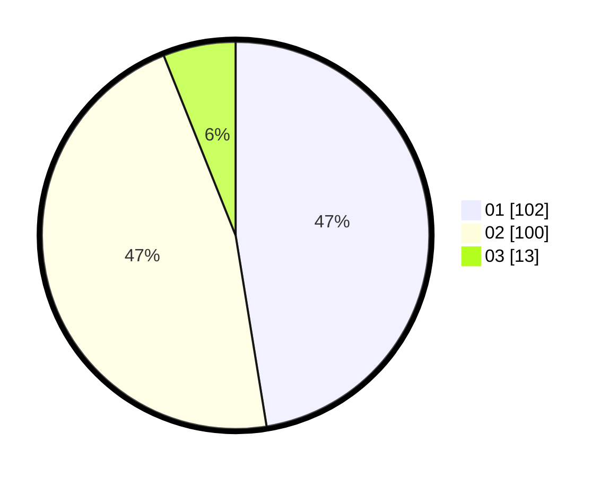

# Hasil

Hasil perolehan suara paslon dapat dilihat pada file paslon-01.txt, paslon-02.txt, dan paslon-03.txt.

Jika tidak ada, artinya data tersebut belum ada pada SIREKAP.

## Perolehan Suara

 * Paslon 01: **102**.
 * Paslon 02: **100**.
 * Paslon 03: **13**.

## Foto C Plano

https://sirekap-obj-formc.kpu.go.id/a66d/pemilu/ppwp/31/75/06/10/07/3175061007003-20240214-184912--89bc69af-161e-440b-bd3a-a0f371e77a53.jpg

https://sirekap-obj-formc.kpu.go.id/a66d/pemilu/ppwp/31/75/06/10/07/3175061007003-20240214-184938--005be12e-ea64-4cd5-a1b6-abfe51b8e708.jpg
