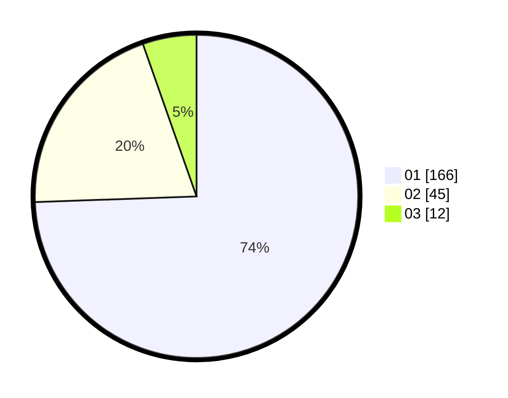

# Hasil

Hasil perolehan suara paslon dapat dilihat pada file paslon-01.txt, paslon-02.txt, dan paslon-03.txt.

Jika tidak ada, artinya data tersebut belum ada pada SIREKAP.

## Perolehan Suara

 * Paslon 01: **166**.
 * Paslon 02: **45**.
 * Paslon 03: **12**.

## Foto C Plano

https://sirekap-obj-formc.kpu.go.id/8c12/pemilu/ppwp/31/75/06/10/07/3175061007016-20240214-231829--326712cf-a05a-4839-9fbd-e3ffb94fd730.jpg

https://sirekap-obj-formc.kpu.go.id/8c12/pemilu/ppwp/31/75/06/10/07/3175061007016-20240214-232151--6f6865d5-002e-4059-8809-ca604a6103dd.jpg

https://sirekap-obj-formc.kpu.go.id/8c12/pemilu/ppwp/31/75/06/10/07/3175061007016-20240214-221923--a45f70ec-09ba-4af0-8096-5f13cf7b7f5e.jpg
