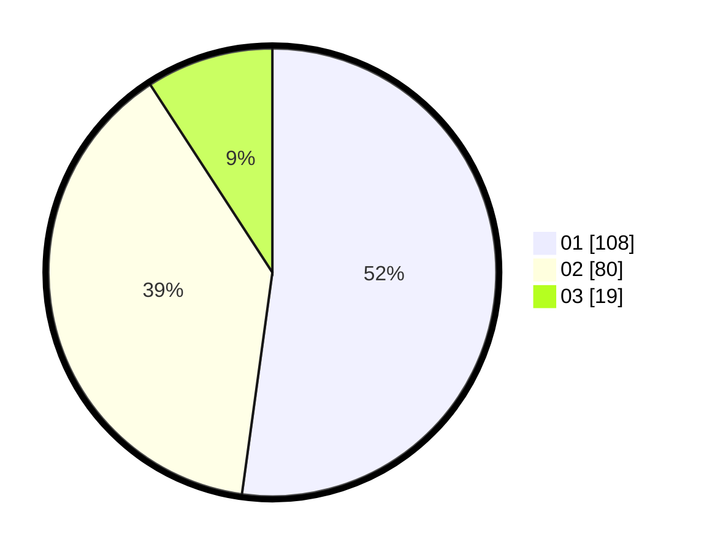

# Hasil

Hasil perolehan suara paslon dapat dilihat pada file paslon-01.txt, paslon-02.txt, dan paslon-03.txt.

Jika tidak ada, artinya data tersebut belum ada pada SIREKAP.

## Perolehan Suara

 * Paslon 01: **108**.
 * Paslon 02: **80**.
 * Paslon 03: **19**.

## Foto C Plano

https://sirekap-obj-formc.kpu.go.id/78f1/pemilu/ppwp/31/75/06/10/07/3175061007020-20240215-212025--582a8d60-15f3-4034-b043-4c4e4b2d3af2.jpg

https://sirekap-obj-formc.kpu.go.id/78f1/pemilu/ppwp/31/75/06/10/07/3175061007020-20240215-212027--55453bc7-13bc-457c-9e03-8514ee7b5a05.jpg

https://sirekap-obj-formc.kpu.go.id/78f1/pemilu/ppwp/31/75/06/10/07/3175061007020-20240215-212026--0982df17-8fb8-48ac-9ab9-c1a235241ffe.jpg

## DATA PEMILIH TETAP

Jumlah pemilih dalam DPT: **254**.
 * L: **123**.
 * P: **131**.

## DATA PENGGUNA HAK PILIH

Jumlah pengguna hak pilih dalam DPT: **209**.
 * L: **95**.
 * P: **114**.

Jumlah pengguna hak pilih dalam DPTb: **0**.
 * L: **0**.
 * P: **0**.

Jumlah pengguna hak pilih dalam DPK: **1**.
 * L: **1**.
 * P: **0**.

Jumlah pengguna hak pilih: **210**.
 * L: **96**.
 * P: **114**.

## JUMLAH SUARA SAH DAN TIDAK SAH

JUMLAH SELURUH SUARA SAH: **207**.

JUMLAH SUARA TIDAK SAH: **3**.

JUMLAH SELURUH SUARA SAH DAN SUARA TIDAK SAH: **210**.
