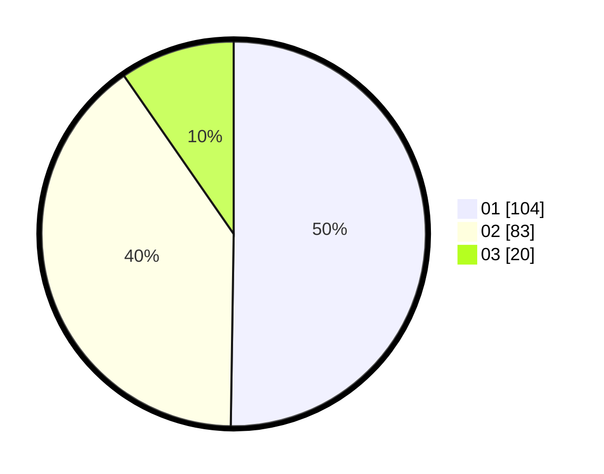

# Hasil

Hasil perolehan suara paslon dapat dilihat pada file paslon-01.txt, paslon-02.txt, dan paslon-03.txt.

Jika tidak ada, artinya data tersebut belum ada pada SIREKAP.

## Perolehan Suara

 * Paslon 01: **104**.
 * Paslon 02: **83**.
 * Paslon 03: **20**.

## Foto C Plano

https://sirekap-obj-formc.kpu.go.id/0965/pemilu/ppwp/31/75/06/10/07/3175061007022-20240214-190726--840f7c97-988a-4b71-9535-b2a402e2e0bc.jpg

https://sirekap-obj-formc.kpu.go.id/0965/pemilu/ppwp/31/75/06/10/07/3175061007022-20240216-013116--ee10bd42-563c-4f0c-98d7-9833623bd52f.jpg

https://sirekap-obj-formc.kpu.go.id/0965/pemilu/ppwp/31/75/06/10/07/3175061007022-20240216-015203--eb76c12f-ee6b-4b96-927c-99efe2312892.jpg

## DATA PEMILIH TETAP

Jumlah pemilih dalam DPT: **274**.
 * L: **136**.
 * P: **138**.

## DATA PENGGUNA HAK PILIH

Jumlah pengguna hak pilih dalam DPT: **209**.
 * L: **101**.
 * P: **108**.

Jumlah pengguna hak pilih dalam DPTb: **0**.
 * L: **0**.
 * P: **0**.

Jumlah pengguna hak pilih dalam DPK: **0**.
 * L: **0**.
 * P: **0**.

Jumlah pengguna hak pilih: **209**.
 * L: **101**.
 * P: **108**.

## JUMLAH SUARA SAH DAN TIDAK SAH

JUMLAH SELURUH SUARA SAH: **207**.

JUMLAH SUARA TIDAK SAH: **2**.

JUMLAH SELURUH SUARA SAH DAN SUARA TIDAK SAH: **209**.
