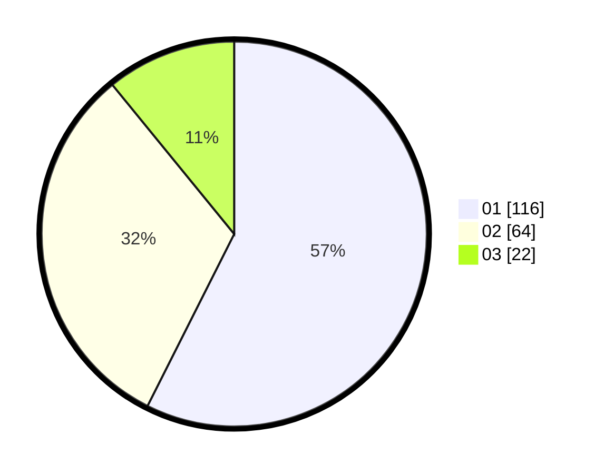

# Hasil

Hasil perolehan suara paslon dapat dilihat pada file paslon-01.txt, paslon-02.txt, dan paslon-03.txt.

Jika tidak ada, artinya data tersebut belum ada pada SIREKAP.

## Perolehan Suara

 * Paslon 01: **116**.
 * Paslon 02: **64**.
 * Paslon 03: **22**.

## Foto C Plano

https://sirekap-obj-formc.kpu.go.id/2c3e/pemilu/ppwp/31/75/06/10/07/3175061007023-20240214-175445--a025f685-a630-403c-96f9-6eb740e6c3be.jpg

https://sirekap-obj-formc.kpu.go.id/2c3e/pemilu/ppwp/31/75/06/10/07/3175061007023-20240214-231942--30ab5aa4-bfec-4be7-8fa3-8f4520f8ebdf.jpg

https://sirekap-obj-formc.kpu.go.id/2c3e/pemilu/ppwp/31/75/06/10/07/3175061007023-20240214-175446--bd0ebff1-49ce-42ff-a4b6-956a7d5dd405.jpg

## DATA PEMILIH TETAP

Jumlah pemilih dalam DPT: **270**.
 * L: **136**.
 * P: **134**.

## DATA PENGGUNA HAK PILIH

Jumlah pengguna hak pilih dalam DPT: **200**.
 * L: **98**.
 * P: **102**.

Jumlah pengguna hak pilih dalam DPTb: **0**.
 * L: **0**.
 * P: **0**.

Jumlah pengguna hak pilih dalam DPK: **4**.
 * L: **2**.
 * P: **2**.

Jumlah pengguna hak pilih: **204**.
 * L: **100**.
 * P: **104**.

## JUMLAH SUARA SAH DAN TIDAK SAH

JUMLAH SELURUH SUARA SAH: **202**.

JUMLAH SUARA TIDAK SAH: **2**.

JUMLAH SELURUH SUARA SAH DAN SUARA TIDAK SAH: **204**.
