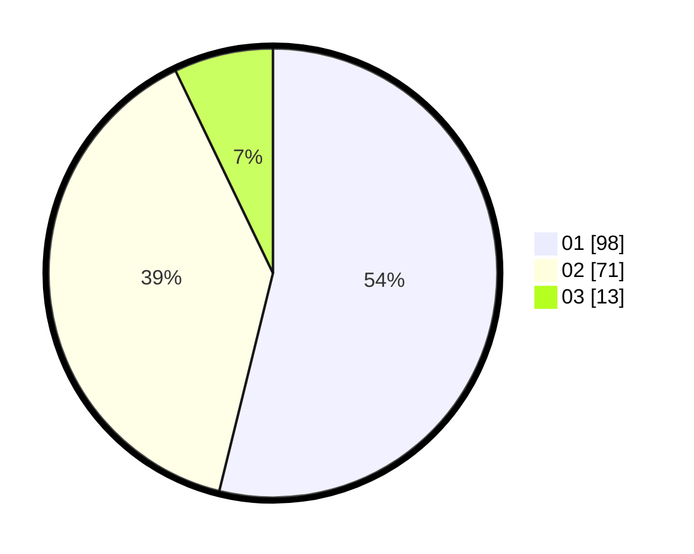

# Hasil

Hasil perolehan suara paslon dapat dilihat pada file paslon-01.txt, paslon-02.txt, dan paslon-03.txt.

Jika tidak ada, artinya data tersebut belum ada pada SIREKAP.

## Perolehan Suara

 * Paslon 01: **98**.
 * Paslon 02: **71**.
 * Paslon 03: **13**.

## Foto C Plano

https://sirekap-obj-formc.kpu.go.id/7a5a/pemilu/ppwp/31/75/06/10/07/3175061007024-20240214-202321--9236acf0-7030-4291-b7f2-1153a0d71016.jpg

https://sirekap-obj-formc.kpu.go.id/7a5a/pemilu/ppwp/31/75/06/10/07/3175061007024-20240214-224256--fd9c4803-eaad-4850-be62-9dde20ee871f.jpg

https://sirekap-obj-formc.kpu.go.id/7a5a/pemilu/ppwp/31/75/06/10/07/3175061007024-20240214-202538--8f2595bb-1306-4b63-8315-b42e07254a93.jpg
