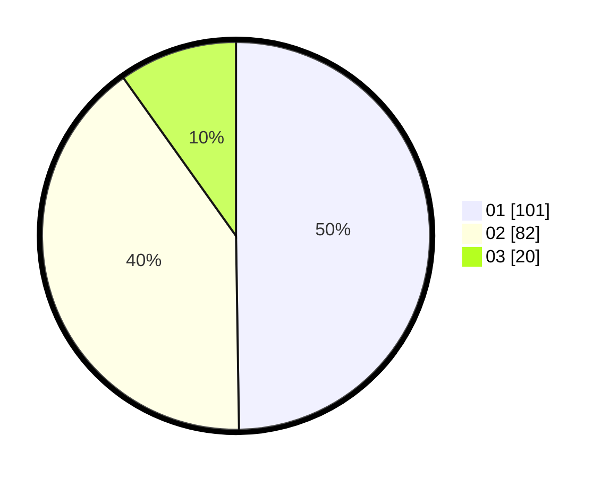

# Hasil

Hasil perolehan suara paslon dapat dilihat pada file paslon-01.txt, paslon-02.txt, dan paslon-03.txt.

Jika tidak ada, artinya data tersebut belum ada pada SIREKAP.

## Perolehan Suara

 * Paslon 01: **101**.
 * Paslon 02: **82**.
 * Paslon 03: **20**.

## Foto C Plano

https://sirekap-obj-formc.kpu.go.id/6e94/pemilu/ppwp/31/75/06/10/07/3175061007034-20240215-083720--614f2257-3edf-48f1-a4f1-bebd6f80cef5.jpg

https://sirekap-obj-formc.kpu.go.id/6e94/pemilu/ppwp/31/75/06/10/07/3175061007034-20240215-083835--a09d92d7-53a0-4462-95c5-20e65b6e8862.jpg

https://sirekap-obj-formc.kpu.go.id/6e94/pemilu/ppwp/31/75/06/10/07/3175061007034-20240215-084004--9b0c9822-3fa1-4c4e-b666-01314f89cb17.jpg
