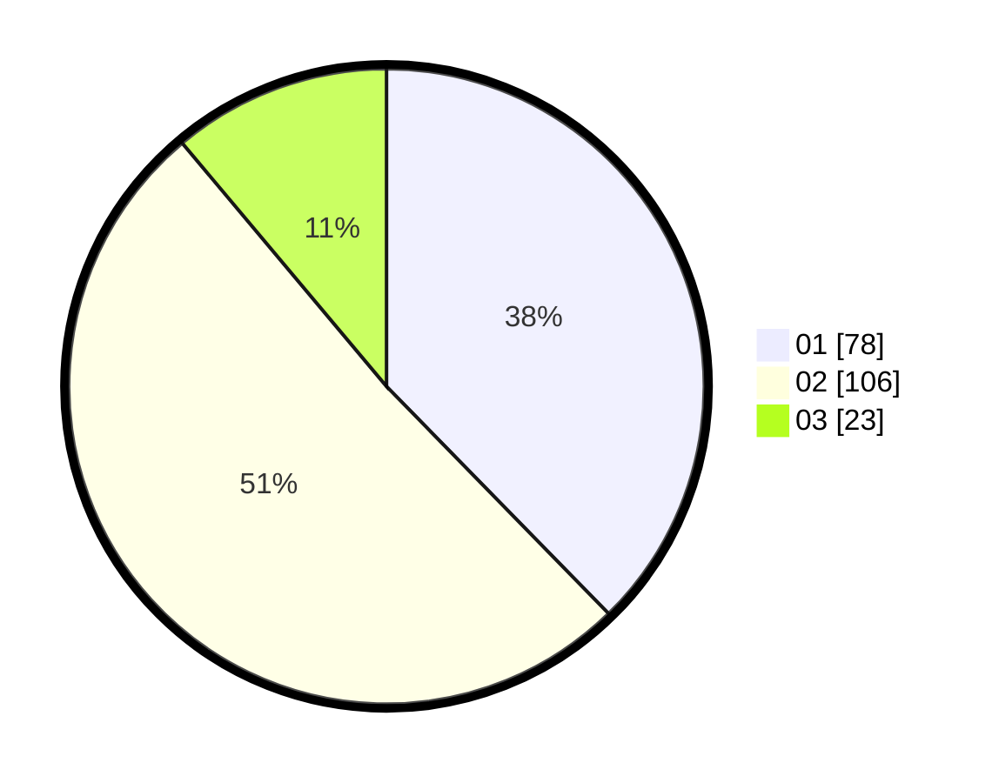

# Hasil

Hasil perolehan suara paslon dapat dilihat pada file paslon-01.txt, paslon-02.txt, dan paslon-03.txt.

Jika tidak ada, artinya data tersebut belum ada pada SIREKAP.

## Perolehan Suara

 * Paslon 01: **78**.
 * Paslon 02: **106**.
 * Paslon 03: **23**.

## Foto C Plano

https://sirekap-obj-formc.kpu.go.id/900a/pemilu/ppwp/31/75/06/10/07/3175061007037-20240214-202414--7dd6259f-95ea-4e96-b82f-01b86e7e6726.jpg

https://sirekap-obj-formc.kpu.go.id/900a/pemilu/ppwp/31/75/06/10/07/3175061007037-20240214-202505--a7a54fec-d5f1-4f4e-81d8-07805b4f8a26.jpg

https://sirekap-obj-formc.kpu.go.id/900a/pemilu/ppwp/31/75/06/10/07/3175061007037-20240214-202546--4ebdc488-6a94-4585-be3b-e07804e6f17a.jpg
