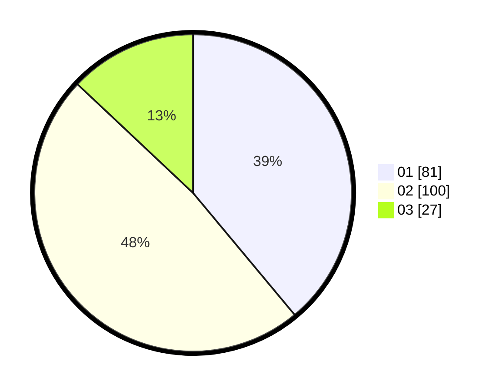

# Hasil

Hasil perolehan suara paslon dapat dilihat pada file paslon-01.txt, paslon-02.txt, dan paslon-03.txt.

Jika tidak ada, artinya data tersebut belum ada pada SIREKAP.

## Perolehan Suara

 * Paslon 01: **81**.
 * Paslon 02: **100**.
 * Paslon 03: **27**.

## Foto C Plano

https://sirekap-obj-formc.kpu.go.id/b893/pemilu/ppwp/31/75/06/10/07/3175061007038-20240215-000008--cc852a7e-f2c5-4a18-8f35-8a6b9e1288e8.jpg

https://sirekap-obj-formc.kpu.go.id/b893/pemilu/ppwp/31/75/06/10/07/3175061007038-20240215-000054--0b6d452a-31f5-4a35-8852-d1d303d7bf4e.jpg

https://sirekap-obj-formc.kpu.go.id/b893/pemilu/ppwp/31/75/06/10/07/3175061007038-20240215-000125--46d65af4-21ed-4eb2-828c-6d811013b715.jpg
