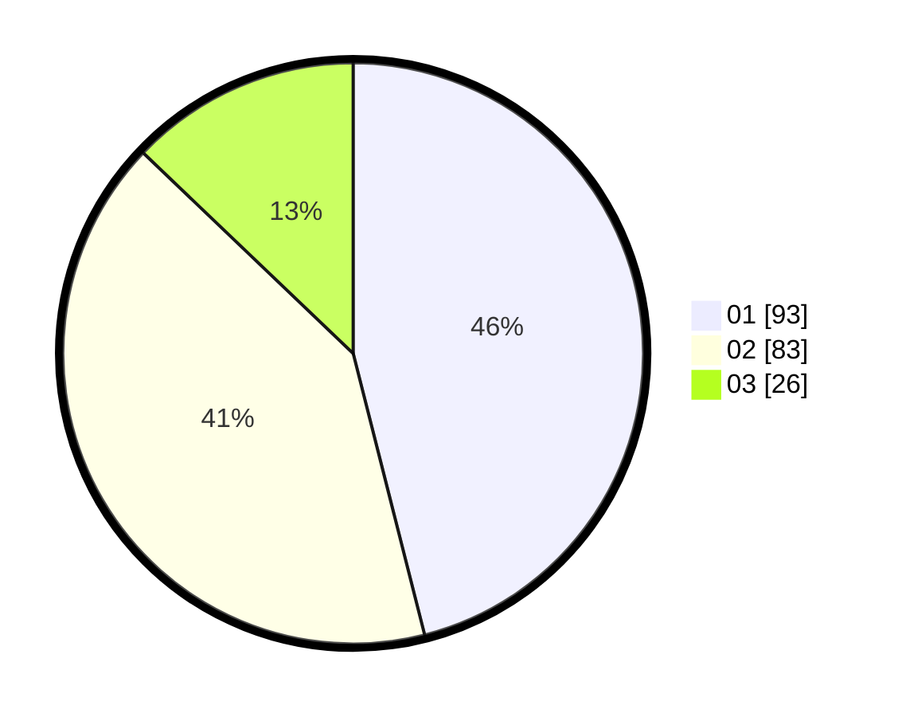

# Hasil

Hasil perolehan suara paslon dapat dilihat pada file paslon-01.txt, paslon-02.txt, dan paslon-03.txt.

Jika tidak ada, artinya data tersebut belum ada pada SIREKAP.

## Perolehan Suara

 * Paslon 01: **93**.
 * Paslon 02: **83**.
 * Paslon 03: **26**.

## Foto C Plano

https://sirekap-obj-formc.kpu.go.id/c132/pemilu/ppwp/31/75/06/10/07/3175061007040-20240214-224811--ed541d9b-0f5a-44e5-a526-6d8e69d23426.jpg

https://sirekap-obj-formc.kpu.go.id/c132/pemilu/ppwp/31/75/06/10/07/3175061007040-20240214-193903--da6f702d-9dc0-40d9-a296-4e99f9586bed.jpg

https://sirekap-obj-formc.kpu.go.id/c132/pemilu/ppwp/31/75/06/10/07/3175061007040-20240214-193909--cecdbbab-f989-4f9c-9468-eb52ec623358.jpg
