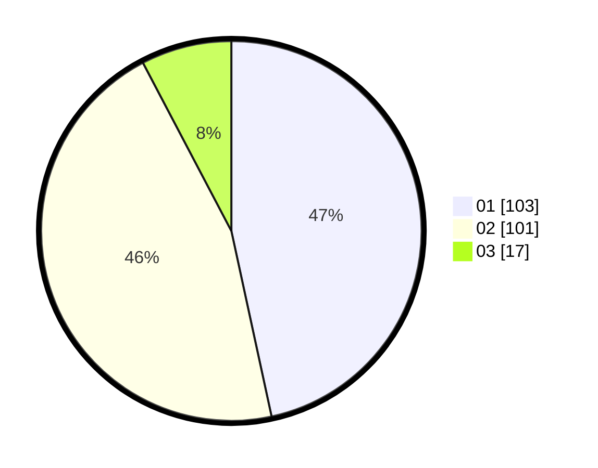

# Hasil

Hasil perolehan suara paslon dapat dilihat pada file paslon-01.txt, paslon-02.txt, dan paslon-03.txt.

Jika tidak ada, artinya data tersebut belum ada pada SIREKAP.

## Perolehan Suara

 * Paslon 01: **103**.
 * Paslon 02: **101**.
 * Paslon 03: **17**.

## Foto C Plano

https://sirekap-obj-formc.kpu.go.id/03f7/pemilu/ppwp/31/75/06/10/07/3175061007044-20240214-221436--37a6d264-59bf-449b-a328-de1704aaf356.jpg

https://sirekap-obj-formc.kpu.go.id/03f7/pemilu/ppwp/31/75/06/10/07/3175061007044-20240214-175308--9b62f3ad-840a-4853-a6b5-893bcb25e21b.jpg

https://sirekap-obj-formc.kpu.go.id/03f7/pemilu/ppwp/31/75/06/10/07/3175061007044-20240214-222003--fd576fc4-672f-4f16-a6ed-af53f5bb1599.jpg
