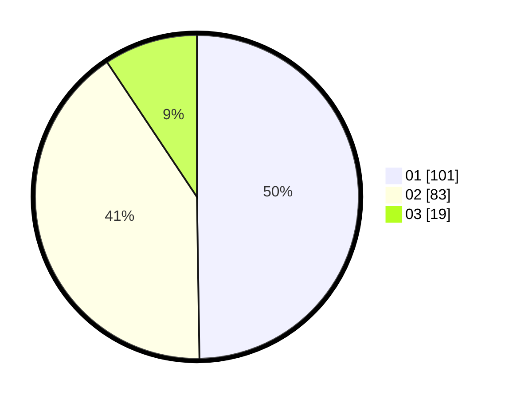

# Hasil

Hasil perolehan suara paslon dapat dilihat pada file paslon-01.txt, paslon-02.txt, dan paslon-03.txt.

Jika tidak ada, artinya data tersebut belum ada pada SIREKAP.

## Perolehan Suara

 * Paslon 01: **101**.
 * Paslon 02: **83**.
 * Paslon 03: **19**.

## Foto C Plano

https://sirekap-obj-formc.kpu.go.id/a826/pemilu/ppwp/31/75/06/10/07/3175061007051-20240215-021313--2a2c5fea-1aaa-4e0b-85ce-1dc5587a4aaa.jpg

https://sirekap-obj-formc.kpu.go.id/a826/pemilu/ppwp/31/75/06/10/07/3175061007051-20240215-021336--6236567e-0372-46af-85dc-1a0fa6aff0c2.jpg

https://sirekap-obj-formc.kpu.go.id/a826/pemilu/ppwp/31/75/06/10/07/3175061007051-20240215-021324--fb805eb8-695b-48b1-8776-fb0662f3782e.jpg

## DATA PEMILIH TETAP

Jumlah pemilih dalam DPT: **257**.
 * L: **138**.
 * P: **119**.

## DATA PENGGUNA HAK PILIH

Jumlah pengguna hak pilih dalam DPT: **206**.
 * L: **107**.
 * P: **99**.

Jumlah pengguna hak pilih dalam DPTb: **0**.
 * L: **0**.
 * P: **0**.

Jumlah pengguna hak pilih dalam DPK: **0**.
 * L: **0**.
 * P: **0**.

Jumlah pengguna hak pilih: **206**.
 * L: **107**.
 * P: **99**.

## JUMLAH SUARA SAH DAN TIDAK SAH

JUMLAH SELURUH SUARA SAH: **203**.

JUMLAH SUARA TIDAK SAH: **3**.

JUMLAH SELURUH SUARA SAH DAN SUARA TIDAK SAH: **206**.
