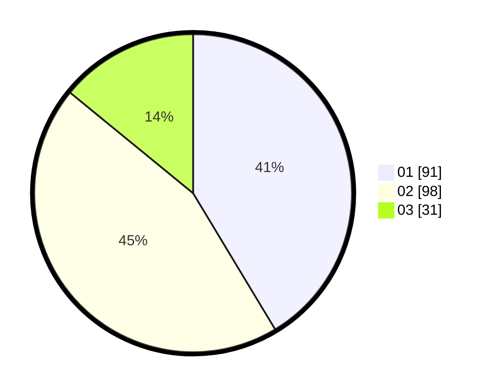

# Hasil

Hasil perolehan suara paslon dapat dilihat pada file paslon-01.txt, paslon-02.txt, dan paslon-03.txt.

Jika tidak ada, artinya data tersebut belum ada pada SIREKAP.

## Perolehan Suara

 * Paslon 01: **91**.
 * Paslon 02: **98**.
 * Paslon 03: **31**.

## Foto C Plano

https://sirekap-obj-formc.kpu.go.id/438e/pemilu/ppwp/31/75/06/10/07/3175061007054-20240214-212753--e1a4c5fb-b9f0-4394-ad86-dbb2bedc9fae.jpg

https://sirekap-obj-formc.kpu.go.id/438e/pemilu/ppwp/31/75/06/10/07/3175061007054-20240214-213055--3f5352a5-d696-4aaf-b383-fb99aa4b69ff.jpg

https://sirekap-obj-formc.kpu.go.id/438e/pemilu/ppwp/31/75/06/10/07/3175061007054-20240214-212939--8933a19f-395a-4128-bbfa-ff073ce5bb4f.jpg
