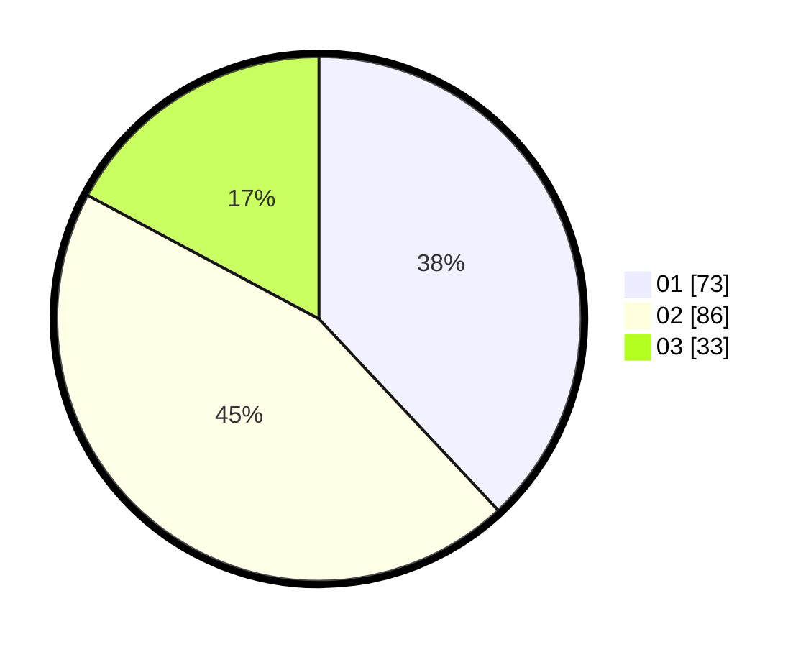

# Hasil

Hasil perolehan suara paslon dapat dilihat pada file paslon-01.txt, paslon-02.txt, dan paslon-03.txt.

Jika tidak ada, artinya data tersebut belum ada pada SIREKAP.

## Perolehan Suara

 * Paslon 01: **73**.
 * Paslon 02: **86**.
 * Paslon 03: **33**.

## Foto C Plano

https://sirekap-obj-formc.kpu.go.id/0fb6/pemilu/ppwp/31/75/06/10/07/3175061007056-20240214-184852--3a3a5b03-fc94-4321-b4d0-0369fdf83f8f.jpg

https://sirekap-obj-formc.kpu.go.id/0fb6/pemilu/ppwp/31/75/06/10/07/3175061007056-20240214-184904--b4abb3ae-e495-4b0d-bf7c-7e4887ad9309.jpg

https://sirekap-obj-formc.kpu.go.id/0fb6/pemilu/ppwp/31/75/06/10/07/3175061007056-20240214-184919--e39d120f-e9d3-422c-91fb-cb75516a6ecc.jpg

## DATA PEMILIH TETAP

Jumlah pemilih dalam DPT: **266**.
 * L: **131**.
 * P: **135**.

## DATA PENGGUNA HAK PILIH

Jumlah pengguna hak pilih dalam DPT: **192**.
 * L: **82**.
 * P: **110**.

Jumlah pengguna hak pilih dalam DPTb: **2**.
 * L: **2**.
 * P: **0**.

Jumlah pengguna hak pilih dalam DPK: **1**.
 * L: **0**.
 * P: **1**.

Jumlah pengguna hak pilih: **195**.
 * L: **84**.
 * P: **111**.

## JUMLAH SUARA SAH DAN TIDAK SAH

JUMLAH SELURUH SUARA SAH: **192**.

JUMLAH SUARA TIDAK SAH: **3**.

JUMLAH SELURUH SUARA SAH DAN SUARA TIDAK SAH: **195**.
