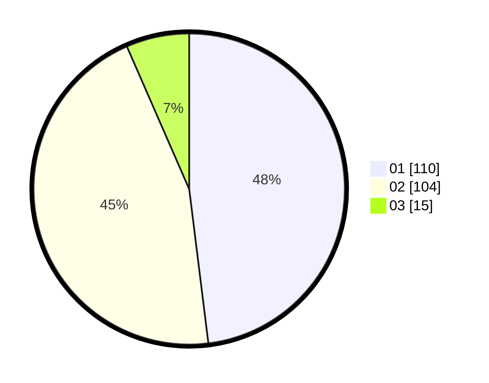

# Hasil

Hasil perolehan suara paslon dapat dilihat pada file paslon-01.txt, paslon-02.txt, dan paslon-03.txt.

Jika tidak ada, artinya data tersebut belum ada pada SIREKAP.

## Perolehan Suara

 * Paslon 01: **110**.
 * Paslon 02: **104**.
 * Paslon 03: **15**.

## Foto C Plano

https://sirekap-obj-formc.kpu.go.id/d141/pemilu/ppwp/31/75/06/10/07/3175061007068-20240214-155212--51acb572-f809-4741-8697-c01928192f91.jpg

https://sirekap-obj-formc.kpu.go.id/d141/pemilu/ppwp/31/75/06/10/07/3175061007068-20240214-141624--68fd26da-8a84-471b-880d-309eab30f1ce.jpg

https://sirekap-obj-formc.kpu.go.id/d141/pemilu/ppwp/31/75/06/10/07/3175061007068-20240214-155228--c5041c63-e2a6-45da-a5d6-157204d8eae3.jpg

## DATA PEMILIH TETAP

Jumlah pemilih dalam DPT: **268**.
 * L: **143**.
 * P: **125**.

## DATA PENGGUNA HAK PILIH

Jumlah pengguna hak pilih dalam DPT: **230**.
 * L: **118**.
 * P: **112**.

Jumlah pengguna hak pilih dalam DPTb: **0**.
 * L: **0**.
 * P: **0**.

Jumlah pengguna hak pilih dalam DPK: **0**.
 * L: **0**.
 * P: **0**.

Jumlah pengguna hak pilih: **230**.
 * L: **118**.
 * P: **112**.

## JUMLAH SUARA SAH DAN TIDAK SAH

JUMLAH SELURUH SUARA SAH: **229**.

JUMLAH SUARA TIDAK SAH: **1**.

JUMLAH SELURUH SUARA SAH DAN SUARA TIDAK SAH: **230**.
