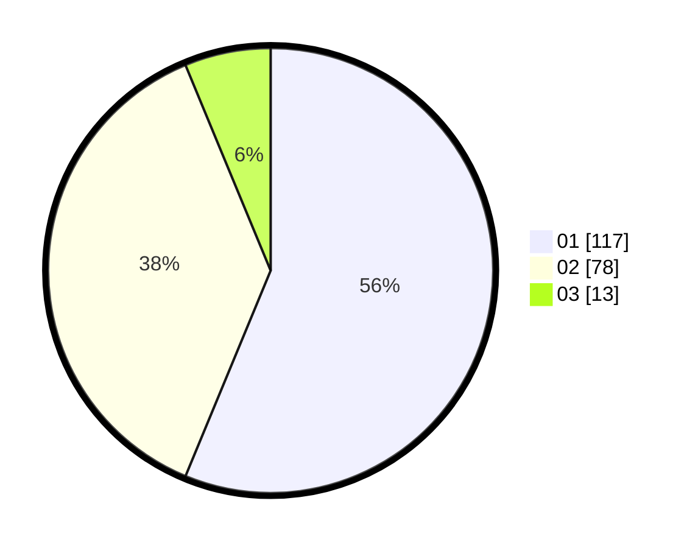

# Hasil

Hasil perolehan suara paslon dapat dilihat pada file paslon-01.txt, paslon-02.txt, dan paslon-03.txt.

Jika tidak ada, artinya data tersebut belum ada pada SIREKAP.

## Perolehan Suara

 * Paslon 01: **117**.
 * Paslon 02: **78**.
 * Paslon 03: **13**.

## Foto C Plano

https://sirekap-obj-formc.kpu.go.id/ca81/pemilu/ppwp/31/75/06/10/07/3175061007070-20240215-235535--a19a263b-ef56-4642-82f1-51e295c989db.jpg

https://sirekap-obj-formc.kpu.go.id/ca81/pemilu/ppwp/31/75/06/10/07/3175061007070-20240215-235537--6d3b6b98-39b7-4359-997f-8fa77844bccd.jpg

https://sirekap-obj-formc.kpu.go.id/ca81/pemilu/ppwp/31/75/06/10/07/3175061007070-20240215-235536--8fd67df0-cdf9-426d-a5ac-8a584b05c5e2.jpg

## DATA PEMILIH TETAP

Jumlah pemilih dalam DPT: **248**.
 * L: **131**.
 * P: **117**.

## DATA PENGGUNA HAK PILIH

Jumlah pengguna hak pilih dalam DPT: **210**.
 * L: **108**.
 * P: **102**.

Jumlah pengguna hak pilih dalam DPTb: **0**.
 * L: **0**.
 * P: **0**.

Jumlah pengguna hak pilih dalam DPK: **0**.
 * L: **0**.
 * P: **0**.

Jumlah pengguna hak pilih: **210**.
 * L: **108**.
 * P: **102**.

## JUMLAH SUARA SAH DAN TIDAK SAH

JUMLAH SELURUH SUARA SAH: **208**.

JUMLAH SUARA TIDAK SAH: **2**.

JUMLAH SELURUH SUARA SAH DAN SUARA TIDAK SAH: **210**.
