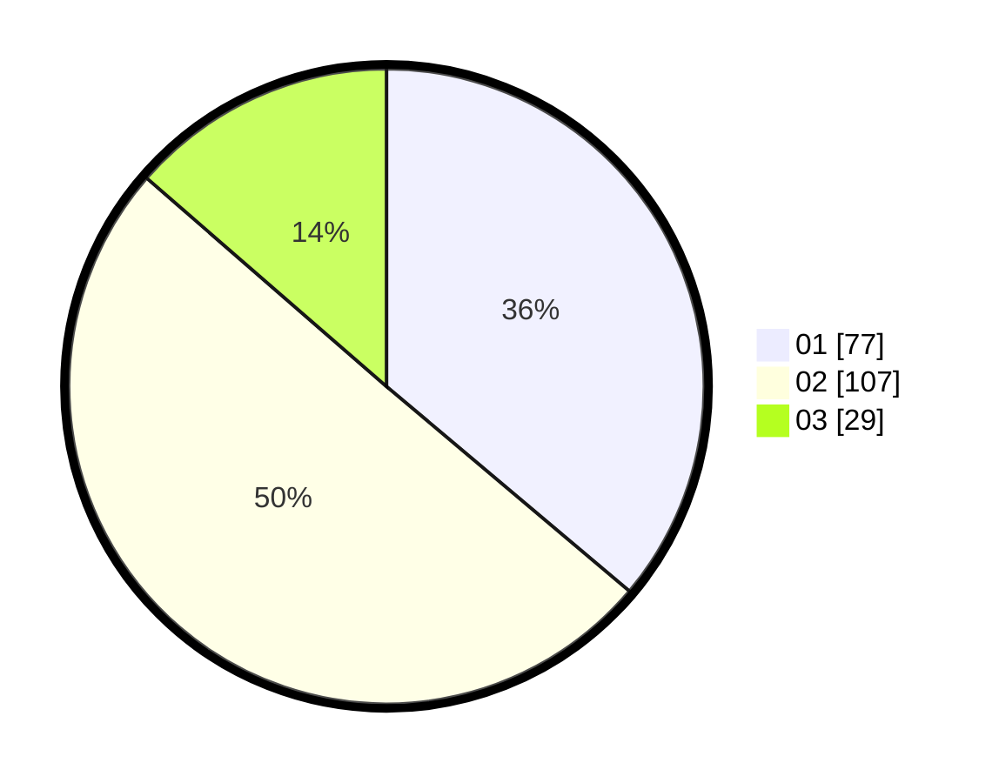

# Hasil

Hasil perolehan suara paslon dapat dilihat pada file paslon-01.txt, paslon-02.txt, dan paslon-03.txt.

Jika tidak ada, artinya data tersebut belum ada pada SIREKAP.

## Perolehan Suara

 * Paslon 01: **77**.
 * Paslon 02: **107**.
 * Paslon 03: **29**.

## Foto C Plano

https://sirekap-obj-formc.kpu.go.id/3549/pemilu/ppwp/31/75/06/10/07/3175061007079-20240214-215812--07f815e2-cb01-4949-9bed-f989f876cebe.jpg

https://sirekap-obj-formc.kpu.go.id/3549/pemilu/ppwp/31/75/06/10/07/3175061007079-20240214-215954--6bff5d35-cb2b-4cc0-832d-f645e1bb7fcf.jpg

https://sirekap-obj-formc.kpu.go.id/3549/pemilu/ppwp/31/75/06/10/07/3175061007079-20240214-220004--701ea24f-5124-46ff-9af0-b6690a430d3f.jpg

## DATA PEMILIH TETAP

Jumlah pemilih dalam DPT: **271**.
 * L: **146**.
 * P: **125**.

## DATA PENGGUNA HAK PILIH

Jumlah pengguna hak pilih dalam DPT: **214**.
 * L: **114**.
 * P: **100**.

Jumlah pengguna hak pilih dalam DPTb: **0**.
 * L: **0**.
 * P: **0**.

Jumlah pengguna hak pilih dalam DPK: **1**.
 * L: **1**.
 * P: **0**.

Jumlah pengguna hak pilih: **215**.
 * L: **115**.
 * P: **100**.

## JUMLAH SUARA SAH DAN TIDAK SAH

JUMLAH SELURUH SUARA SAH: **213**.

JUMLAH SUARA TIDAK SAH: **2**.

JUMLAH SELURUH SUARA SAH DAN SUARA TIDAK SAH: **215**.
