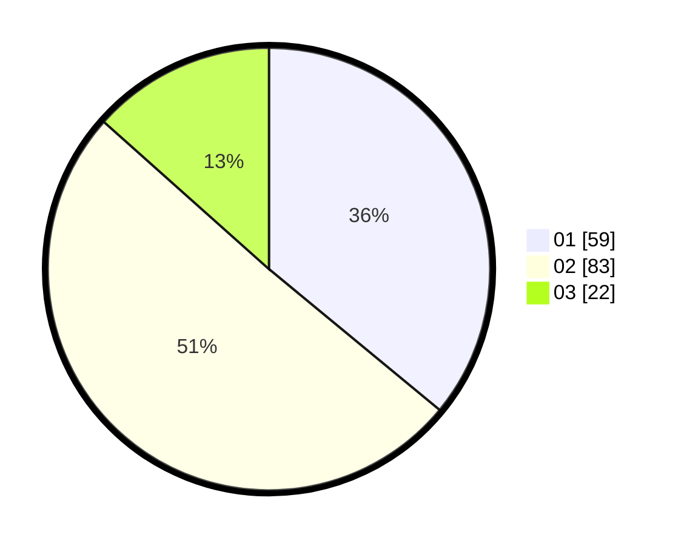

# Hasil

Hasil perolehan suara paslon dapat dilihat pada file paslon-01.txt, paslon-02.txt, dan paslon-03.txt.

Jika tidak ada, artinya data tersebut belum ada pada SIREKAP.

## Perolehan Suara

 * Paslon 01: **59**.
 * Paslon 02: **83**.
 * Paslon 03: **22**.

## Foto C Plano

https://sirekap-obj-formc.kpu.go.id/1ee5/pemilu/ppwp/31/75/06/10/07/3175061007081-20240214-231312--4840ff72-0573-4918-a762-5c3c4a16ca4b.jpg

https://sirekap-obj-formc.kpu.go.id/1ee5/pemilu/ppwp/31/75/06/10/07/3175061007081-20240215-000408--241c00a8-ed4e-4f92-a7ca-064cafbbe1f4.jpg

https://sirekap-obj-formc.kpu.go.id/1ee5/pemilu/ppwp/31/75/06/10/07/3175061007081-20240215-000834--55d1fef3-c91a-4f88-9a32-982827905d7b.jpg
