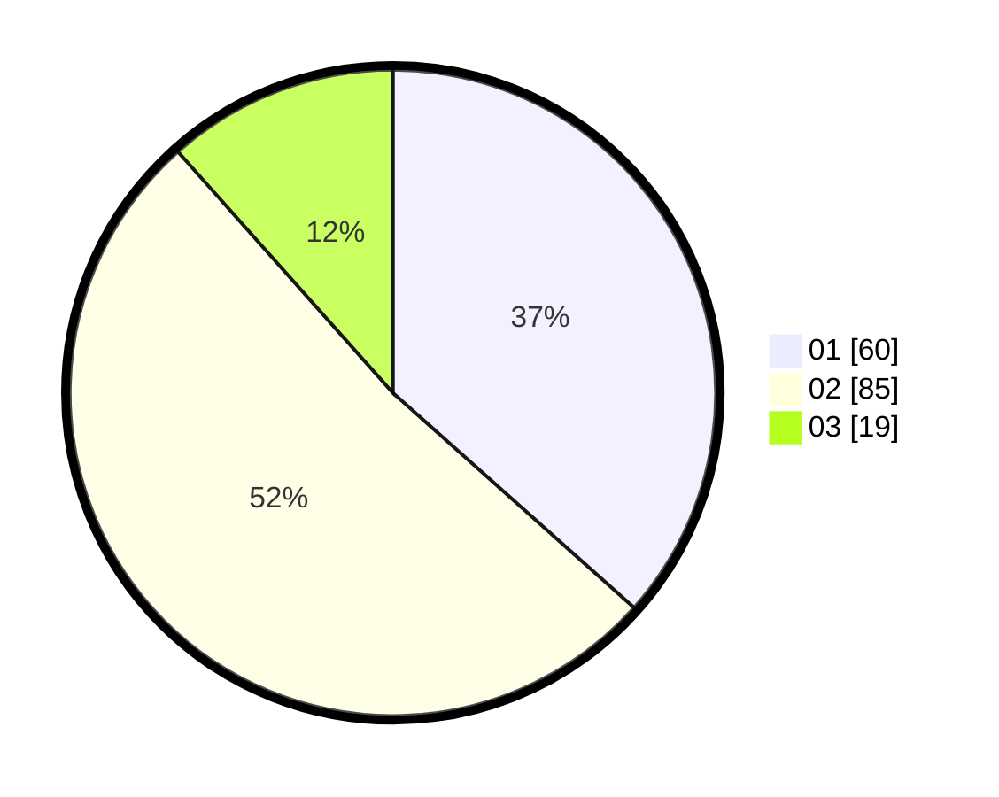

# Hasil

Hasil perolehan suara paslon dapat dilihat pada file paslon-01.txt, paslon-02.txt, dan paslon-03.txt.

Jika tidak ada, artinya data tersebut belum ada pada SIREKAP.

## Perolehan Suara

 * Paslon 01: **60**.
 * Paslon 02: **85**.
 * Paslon 03: **19**.

## Foto C Plano

https://sirekap-obj-formc.kpu.go.id/54c2/pemilu/ppwp/31/75/06/10/07/3175061007086-20240214-200823--0e76ef6e-e2f8-4fc8-ac18-27edfdfd7b82.jpg

https://sirekap-obj-formc.kpu.go.id/54c2/pemilu/ppwp/31/75/06/10/07/3175061007086-20240214-194537--5059bc65-f99e-4bbd-8e86-c7b2ff9ca022.jpg

https://sirekap-obj-formc.kpu.go.id/54c2/pemilu/ppwp/31/75/06/10/07/3175061007086-20240214-194541--ae35b169-28e7-4ce1-bb5c-b0b3bf5e1d7c.jpg

## DATA PEMILIH TETAP

Jumlah pemilih dalam DPT: **271**.
 * L: **134**.
 * P: **137**.

## DATA PENGGUNA HAK PILIH

Jumlah pengguna hak pilih dalam DPT: **160**.
 * L: **75**.
 * P: **85**.

Jumlah pengguna hak pilih dalam DPTb: **3**.
 * L: **3**.
 * P: **0**.

Jumlah pengguna hak pilih dalam DPK: **1**.
 * L: **1**.
 * P: **0**.

Jumlah pengguna hak pilih: **164**.
 * L: **79**.
 * P: **85**.

## JUMLAH SUARA SAH DAN TIDAK SAH

JUMLAH SELURUH SUARA SAH: **164**.

JUMLAH SUARA TIDAK SAH: **0**.

JUMLAH SELURUH SUARA SAH DAN SUARA TIDAK SAH: **164**.
