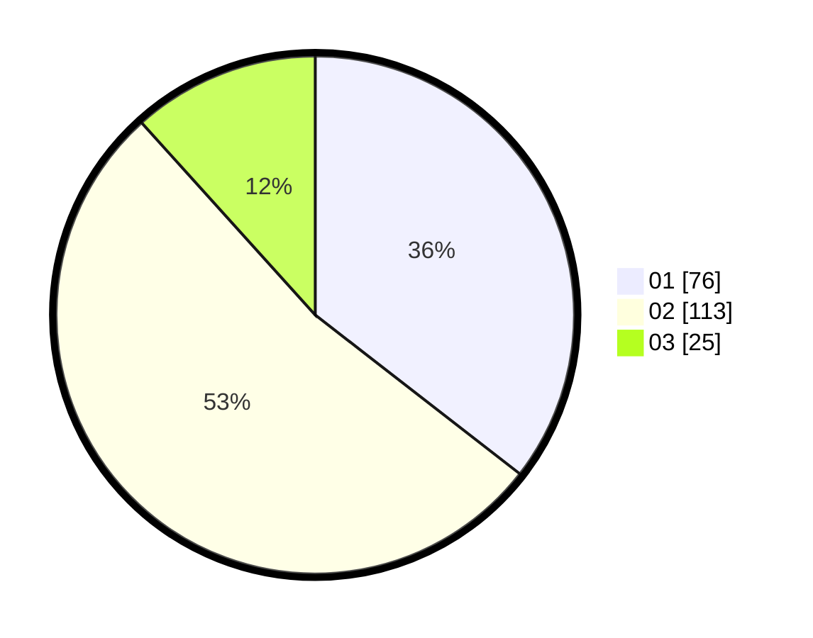

# Hasil

Hasil perolehan suara paslon dapat dilihat pada file paslon-01.txt, paslon-02.txt, dan paslon-03.txt.

Jika tidak ada, artinya data tersebut belum ada pada SIREKAP.

## Perolehan Suara

 * Paslon 01: **76**.
 * Paslon 02: **113**.
 * Paslon 03: **25**.

## Foto C Plano

https://sirekap-obj-formc.kpu.go.id/e992/pemilu/ppwp/31/75/06/10/07/3175061007087-20240214-191214--45593a55-ad84-459c-a041-27d76380b6c5.jpg

https://sirekap-obj-formc.kpu.go.id/e992/pemilu/ppwp/31/75/06/10/07/3175061007087-20240214-141827--90a688a5-effb-455a-a027-8f4e5220532d.jpg

https://sirekap-obj-formc.kpu.go.id/e992/pemilu/ppwp/31/75/06/10/07/3175061007087-20240214-200517--9ea31a32-b2a0-450d-a22b-a1ebac58aab6.jpg

## DATA PEMILIH TETAP

Jumlah pemilih dalam DPT: **269**.
 * L: **138**.
 * P: **131**.

## DATA PENGGUNA HAK PILIH

Jumlah pengguna hak pilih dalam DPT: **207**.
 * L: **105**.
 * P: **102**.

Jumlah pengguna hak pilih dalam DPTb: **0**.
 * L: **0**.
 * P: **0**.

Jumlah pengguna hak pilih dalam DPK: **8**.
 * L: **4**.
 * P: **4**.

Jumlah pengguna hak pilih: **215**.
 * L: **109**.
 * P: **106**.

## JUMLAH SUARA SAH DAN TIDAK SAH

JUMLAH SELURUH SUARA SAH: **214**.

JUMLAH SUARA TIDAK SAH: **1**.

JUMLAH SELURUH SUARA SAH DAN SUARA TIDAK SAH: **215**.
