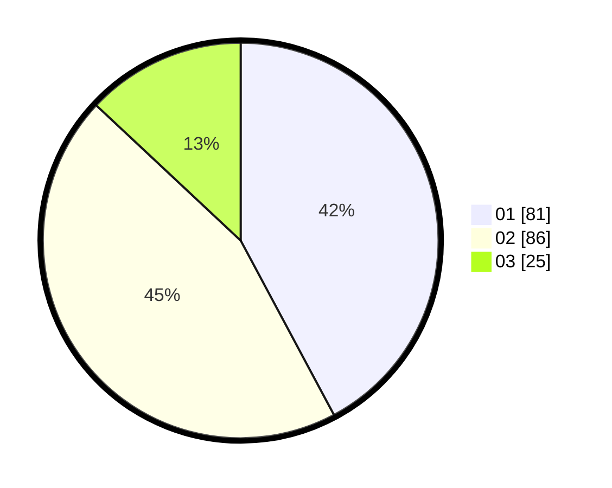

# Hasil

Hasil perolehan suara paslon dapat dilihat pada file paslon-01.txt, paslon-02.txt, dan paslon-03.txt.

Jika tidak ada, artinya data tersebut belum ada pada SIREKAP.

## Perolehan Suara

 * Paslon 01: **81**.
 * Paslon 02: **86**.
 * Paslon 03: **25**.

## Foto C Plano

https://sirekap-obj-formc.kpu.go.id/ac3f/pemilu/ppwp/31/75/06/10/07/3175061007088-20240214-223355--0f3805fd-4bbb-4cfa-9ac0-546fea43361e.jpg

https://sirekap-obj-formc.kpu.go.id/ac3f/pemilu/ppwp/31/75/06/10/07/3175061007088-20240214-223305--598388e5-74da-4025-a967-d6f45173b49b.jpg

https://sirekap-obj-formc.kpu.go.id/ac3f/pemilu/ppwp/31/75/06/10/07/3175061007088-20240214-223103--3a938e43-d206-4c9e-a591-d035e3154a66.jpg
