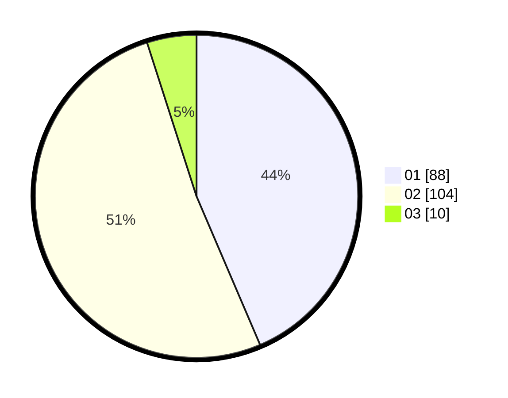

# Hasil

Hasil perolehan suara paslon dapat dilihat pada file paslon-01.txt, paslon-02.txt, dan paslon-03.txt.

Jika tidak ada, artinya data tersebut belum ada pada SIREKAP.

## Perolehan Suara

 * Paslon 01: **88**.
 * Paslon 02: **104**.
 * Paslon 03: **10**.

## Foto C Plano

https://sirekap-obj-formc.kpu.go.id/7aab/pemilu/ppwp/31/75/06/10/07/3175061007093-20240216-041643--76ce2edb-c9ac-4a8a-bb47-4253c59cefa2.jpg

https://sirekap-obj-formc.kpu.go.id/7aab/pemilu/ppwp/31/75/06/10/07/3175061007093-20240216-042751--26ff377e-f3e3-4ea5-99e8-eb2f4ee31aac.jpg

https://sirekap-obj-formc.kpu.go.id/7aab/pemilu/ppwp/31/75/06/10/07/3175061007093-20240216-041648--53347eae-3635-4cda-a1dd-d4bed13a1536.jpg

## DATA PEMILIH TETAP

Jumlah pemilih dalam DPT: **271**.
 * L: **137**.
 * P: **134**.

## DATA PENGGUNA HAK PILIH

Jumlah pengguna hak pilih dalam DPT: **202**.
 * L: **94**.
 * P: **108**.

Jumlah pengguna hak pilih dalam DPTb: **2**.
 * L: **1**.
 * P: **1**.

Jumlah pengguna hak pilih dalam DPK: **0**.
 * L: **0**.
 * P: **0**.

Jumlah pengguna hak pilih: **204**.
 * L: **95**.
 * P: **109**.

## JUMLAH SUARA SAH DAN TIDAK SAH

JUMLAH SELURUH SUARA SAH: **202**.

JUMLAH SUARA TIDAK SAH: **3**.

JUMLAH SELURUH SUARA SAH DAN SUARA TIDAK SAH: **205**.
