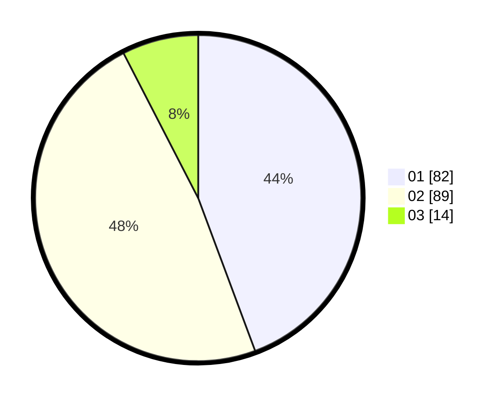

# Hasil

Hasil perolehan suara paslon dapat dilihat pada file paslon-01.txt, paslon-02.txt, dan paslon-03.txt.

Jika tidak ada, artinya data tersebut belum ada pada SIREKAP.

## Perolehan Suara

 * Paslon 01: **82**.
 * Paslon 02: **89**.
 * Paslon 03: **14**.

## Foto C Plano

https://sirekap-obj-formc.kpu.go.id/7e4e/pemilu/ppwp/31/75/06/10/07/3175061007095-20240215-141032--b1c6155d-4903-420d-b928-e25b822ab4b7.jpg

https://sirekap-obj-formc.kpu.go.id/7e4e/pemilu/ppwp/31/75/06/10/07/3175061007095-20240215-141057--4fd7f094-7e5b-42c3-974e-295afc1780af.jpg

https://sirekap-obj-formc.kpu.go.id/7e4e/pemilu/ppwp/31/75/06/10/07/3175061007095-20240215-141046--10fc727d-fa51-4671-b34d-cf013f13d5c5.jpg

## DATA PEMILIH TETAP

Jumlah pemilih dalam DPT: **270**.
 * L: **128**.
 * P: **142**.

## DATA PENGGUNA HAK PILIH

Jumlah pengguna hak pilih dalam DPT: **184**.
 * L: **81**.
 * P: **103**.

Jumlah pengguna hak pilih dalam DPTb: **0**.
 * L: **0**.
 * P: **0**.

Jumlah pengguna hak pilih dalam DPK: **2**.
 * L: **2**.
 * P: **0**.

Jumlah pengguna hak pilih: **186**.
 * L: **83**.
 * P: **103**.

## JUMLAH SUARA SAH DAN TIDAK SAH

JUMLAH SELURUH SUARA SAH: **185**.

JUMLAH SUARA TIDAK SAH: **1**.

JUMLAH SELURUH SUARA SAH DAN SUARA TIDAK SAH: **186**.
