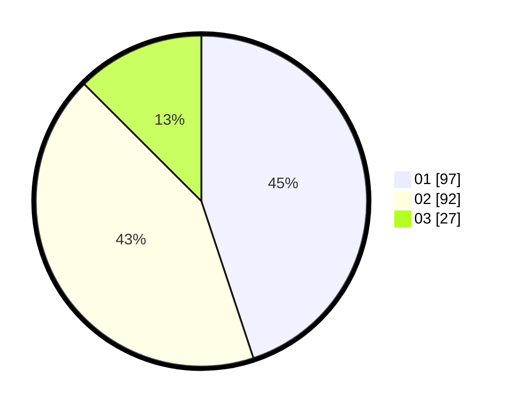

# Hasil

Hasil perolehan suara paslon dapat dilihat pada file paslon-01.txt, paslon-02.txt, dan paslon-03.txt.

Jika tidak ada, artinya data tersebut belum ada pada SIREKAP.

## Perolehan Suara

 * Paslon 01: **97**.
 * Paslon 02: **92**.
 * Paslon 03: **27**.

## Foto C Plano

https://sirekap-obj-formc.kpu.go.id/9988/pemilu/ppwp/31/75/06/10/07/3175061007105-20240215-101418--dba37ce2-cebe-497f-9fce-bf8cb2cb9e2f.jpg

https://sirekap-obj-formc.kpu.go.id/9988/pemilu/ppwp/31/75/06/10/07/3175061007105-20240215-101439--66b21ddc-46b2-4694-b74d-7b875c8c6f7a.jpg

https://sirekap-obj-formc.kpu.go.id/9988/pemilu/ppwp/31/75/06/10/07/3175061007105-20240215-101429--41c4fdf4-77d8-4b52-9699-cb635a9732d8.jpg

## DATA PEMILIH TETAP

Jumlah pemilih dalam DPT: **269**.
 * L: **139**.
 * P: **130**.

## DATA PENGGUNA HAK PILIH

Jumlah pengguna hak pilih dalam DPT: **215**.
 * L: **99**.
 * P: **116**.

Jumlah pengguna hak pilih dalam DPTb: **0**.
 * L: **0**.
 * P: **0**.

Jumlah pengguna hak pilih dalam DPK: **2**.
 * L: **1**.
 * P: **1**.

Jumlah pengguna hak pilih: **217**.
 * L: **100**.
 * P: **117**.

## JUMLAH SUARA SAH DAN TIDAK SAH

JUMLAH SELURUH SUARA SAH: **216**.

JUMLAH SUARA TIDAK SAH: **1**.

JUMLAH SELURUH SUARA SAH DAN SUARA TIDAK SAH: **217**.
