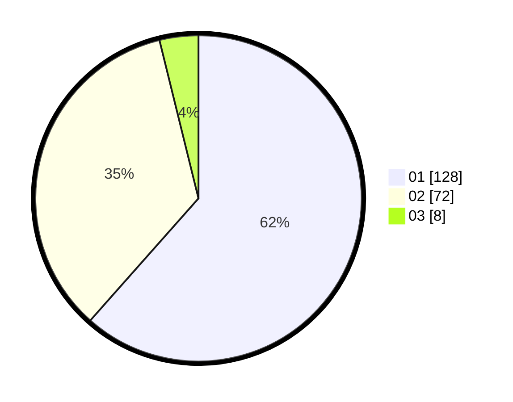

# Hasil

Hasil perolehan suara paslon dapat dilihat pada file paslon-01.txt, paslon-02.txt, dan paslon-03.txt.

Jika tidak ada, artinya data tersebut belum ada pada SIREKAP.

## Perolehan Suara

 * Paslon 01: **128**.
 * Paslon 02: **72**.
 * Paslon 03: **8**.

## Foto C Plano

https://sirekap-obj-formc.kpu.go.id/c9c7/pemilu/ppwp/31/75/06/10/07/3175061007117-20240215-211553--afcc594c-5ec1-4305-9a99-47524092383b.jpg

https://sirekap-obj-formc.kpu.go.id/c9c7/pemilu/ppwp/31/75/06/10/07/3175061007117-20240215-211555--e237555c-4568-4793-9e8d-cc0bbb3821f4.jpg

https://sirekap-obj-formc.kpu.go.id/c9c7/pemilu/ppwp/31/75/06/10/07/3175061007117-20240215-211554--d9052275-9ab9-434b-864a-f29be07de902.jpg

## DATA PEMILIH TETAP

Jumlah pemilih dalam DPT: **264**.
 * L: **127**.
 * P: **137**.

## DATA PENGGUNA HAK PILIH

Jumlah pengguna hak pilih dalam DPT: **210**.
 * L: **99**.
 * P: **111**.

Jumlah pengguna hak pilih dalam DPTb: **0**.
 * L: **0**.
 * P: **0**.

Jumlah pengguna hak pilih dalam DPK: **0**.
 * L: **0**.
 * P: **0**.

Jumlah pengguna hak pilih: **210**.
 * L: **99**.
 * P: **111**.

## JUMLAH SUARA SAH DAN TIDAK SAH

JUMLAH SELURUH SUARA SAH: **208**.

JUMLAH SUARA TIDAK SAH: **2**.

JUMLAH SELURUH SUARA SAH DAN SUARA TIDAK SAH: **210**.
