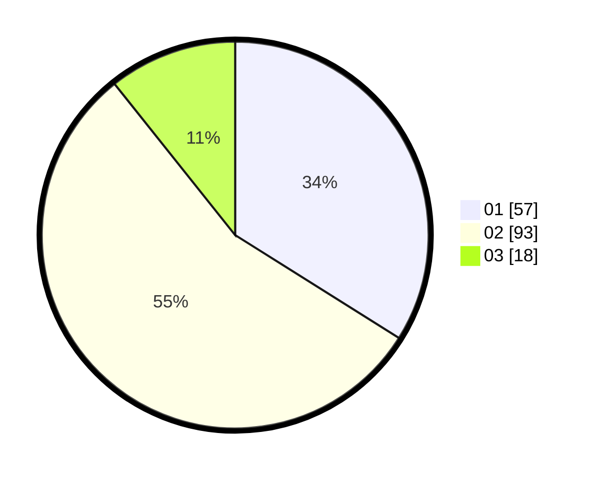

# Hasil

Hasil perolehan suara paslon dapat dilihat pada file paslon-01.txt, paslon-02.txt, dan paslon-03.txt.

Jika tidak ada, artinya data tersebut belum ada pada SIREKAP.

## Perolehan Suara

 * Paslon 01: **57**.
 * Paslon 02: **93**.
 * Paslon 03: **18**.

## Foto C Plano

https://sirekap-obj-formc.kpu.go.id/b11e/pemilu/ppwp/31/75/06/10/07/3175061007120-20240214-200228--f5de662d-17a7-4d05-ba85-686161326ebb.jpg

https://sirekap-obj-formc.kpu.go.id/b11e/pemilu/ppwp/31/75/06/10/07/3175061007120-20240214-195058--0ca94d0b-6895-4ecc-b8c0-75fcf9fdaebf.jpg

https://sirekap-obj-formc.kpu.go.id/b11e/pemilu/ppwp/31/75/06/10/07/3175061007120-20240214-195350--af1981b1-cab9-459d-bb22-b0db3f72a2b3.jpg
