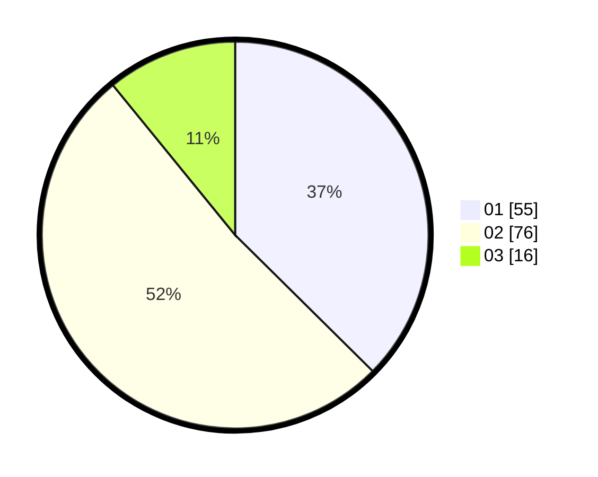

# Hasil

Hasil perolehan suara paslon dapat dilihat pada file paslon-01.txt, paslon-02.txt, dan paslon-03.txt.

Jika tidak ada, artinya data tersebut belum ada pada SIREKAP.

## Perolehan Suara

 * Paslon 01: **55**.
 * Paslon 02: **76**.
 * Paslon 03: **16**.

## Foto C Plano

https://sirekap-obj-formc.kpu.go.id/f810/pemilu/ppwp/31/75/06/10/07/3175061007122-20240214-202535--a7c6fc37-45f9-42a3-952b-b4371ab8ad96.jpg

https://sirekap-obj-formc.kpu.go.id/f810/pemilu/ppwp/31/75/06/10/07/3175061007122-20240214-160108--071b2e13-0477-41e8-b892-4cb17cb46067.jpg

https://sirekap-obj-formc.kpu.go.id/f810/pemilu/ppwp/31/75/06/10/07/3175061007122-20240216-000819--9912adf9-1df1-4fb9-877f-01d3366b87b6.jpg

## DATA PEMILIH TETAP

Jumlah pemilih dalam DPT: **286**.
 * L: **549**.
 * P: **37**.

## DATA PENGGUNA HAK PILIH

Jumlah pengguna hak pilih dalam DPT: **148**.
 * L: **70**.
 * P: **78**.

Jumlah pengguna hak pilih dalam DPTb: **0**.
 * L: **0**.
 * P: **0**.

Jumlah pengguna hak pilih dalam DPK: **1**.
 * L: **0**.
 * P: **1**.

Jumlah pengguna hak pilih: **149**.
 * L: **70**.
 * P: **79**.

## JUMLAH SUARA SAH DAN TIDAK SAH

JUMLAH SELURUH SUARA SAH: **147**.

JUMLAH SUARA TIDAK SAH: **2**.

JUMLAH SELURUH SUARA SAH DAN SUARA TIDAK SAH: **149**.
