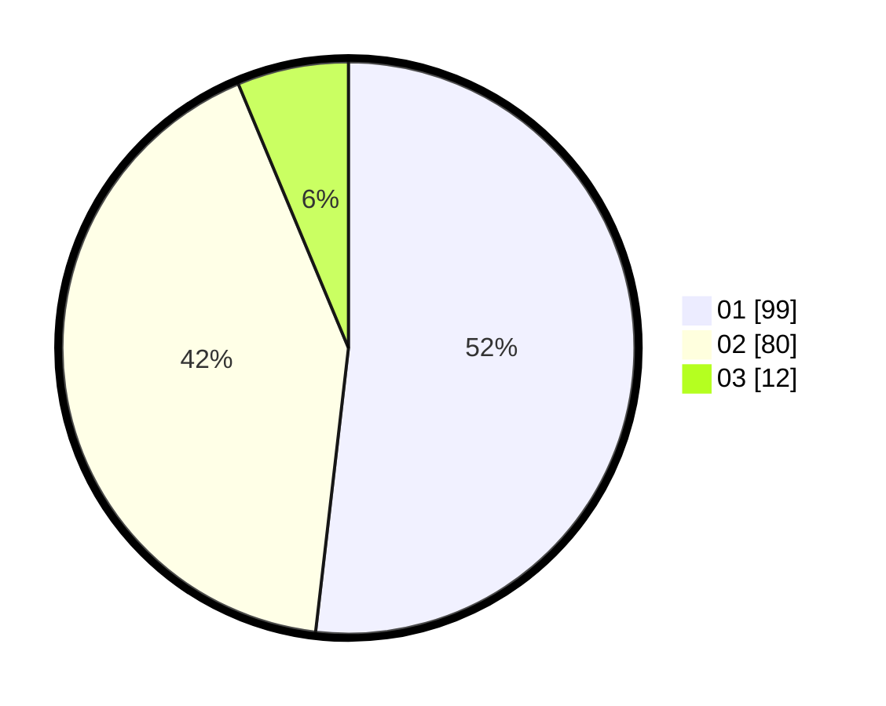

# Hasil

Hasil perolehan suara paslon dapat dilihat pada file paslon-01.txt, paslon-02.txt, dan paslon-03.txt.

Jika tidak ada, artinya data tersebut belum ada pada SIREKAP.

## Perolehan Suara

 * Paslon 01: **99**.
 * Paslon 02: **80**.
 * Paslon 03: **12**.

## Foto C Plano

https://sirekap-obj-formc.kpu.go.id/bd71/pemilu/ppwp/31/75/06/10/07/3175061007128-20240214-212351--fab07fba-018a-4337-8365-a400427246ae.jpg

https://sirekap-obj-formc.kpu.go.id/bd71/pemilu/ppwp/31/75/06/10/07/3175061007128-20240214-212449--878560a8-1954-4f00-a548-1acd4db588ca.jpg

https://sirekap-obj-formc.kpu.go.id/bd71/pemilu/ppwp/31/75/06/10/07/3175061007128-20240214-212536--38b87f44-5b3e-4a10-a01d-5cbb4ebb1eff.jpg
