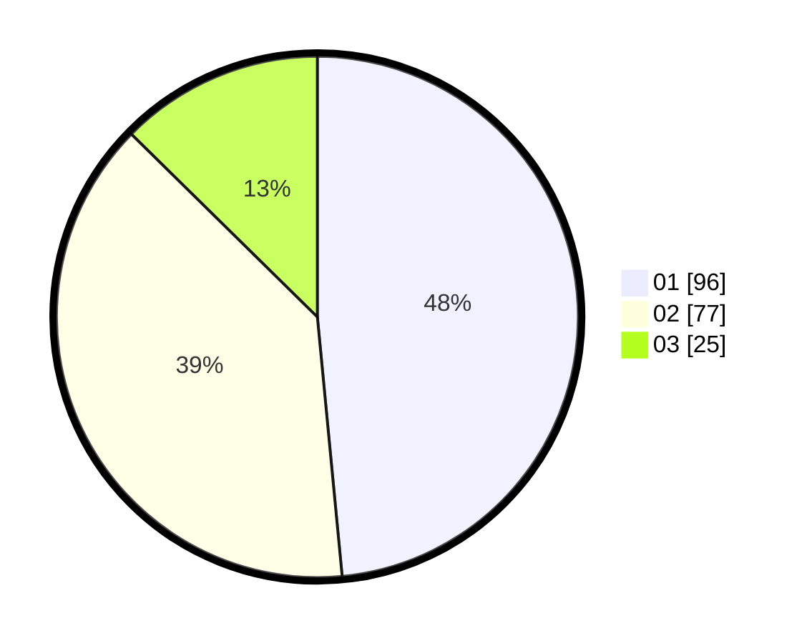

# Hasil

Hasil perolehan suara paslon dapat dilihat pada file paslon-01.txt, paslon-02.txt, dan paslon-03.txt.

Jika tidak ada, artinya data tersebut belum ada pada SIREKAP.

## Perolehan Suara

 * Paslon 01: **96**.
 * Paslon 02: **77**.
 * Paslon 03: **25**.

## Foto C Plano

https://sirekap-obj-formc.kpu.go.id/9440/pemilu/ppwp/31/75/06/10/07/3175061007131-20240215-011221--6e20be03-5552-4e5c-be8e-c8d8285f4a02.jpg

https://sirekap-obj-formc.kpu.go.id/9440/pemilu/ppwp/31/75/06/10/07/3175061007131-20240215-011144--ea5419fc-2946-4d57-a3dc-0f8fc5c66c8f.jpg

https://sirekap-obj-formc.kpu.go.id/9440/pemilu/ppwp/31/75/06/10/07/3175061007131-20240215-011238--fb6db58d-35f4-4821-a135-8033546717aa.jpg
