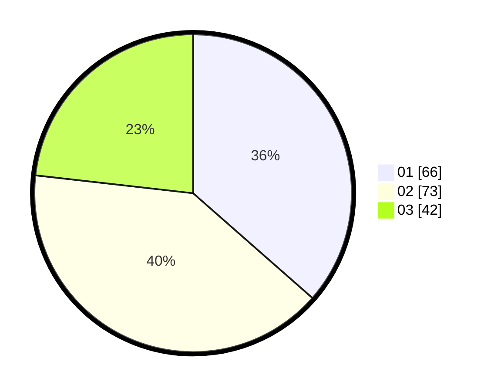

# Hasil

Hasil perolehan suara paslon dapat dilihat pada file paslon-01.txt, paslon-02.txt, dan paslon-03.txt.

Jika tidak ada, artinya data tersebut belum ada pada SIREKAP.

## Perolehan Suara

 * Paslon 01: **66**.
 * Paslon 02: **73**.
 * Paslon 03: **42**.

## Foto C Plano

https://sirekap-obj-formc.kpu.go.id/49a9/pemilu/ppwp/31/75/06/10/07/3175061007137-20240214-225441--5937f835-6963-46c4-ae16-2b33a08a3d34.jpg

https://sirekap-obj-formc.kpu.go.id/49a9/pemilu/ppwp/31/75/06/10/07/3175061007137-20240214-225600--085b303b-055e-491f-b73d-ccf3aabf0c4c.jpg

https://sirekap-obj-formc.kpu.go.id/49a9/pemilu/ppwp/31/75/06/10/07/3175061007137-20240214-225805--779edc2d-ed15-4f49-9e38-8805863a9341.jpg
