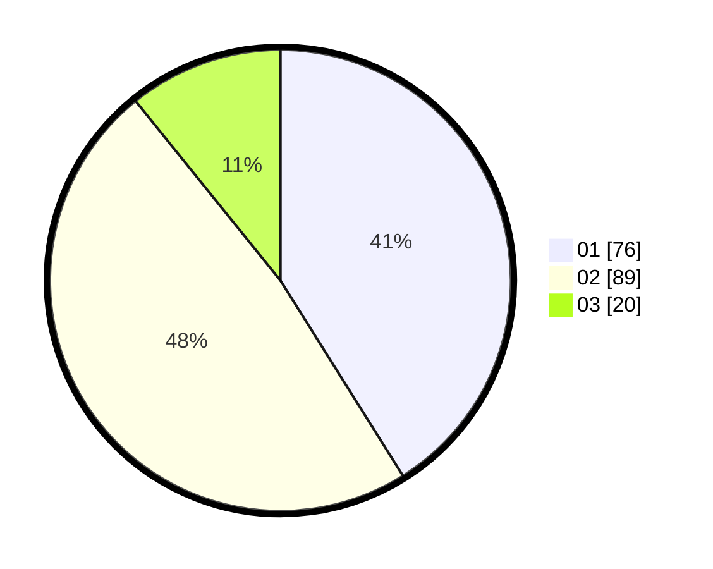

# Hasil

Hasil perolehan suara paslon dapat dilihat pada file paslon-01.txt, paslon-02.txt, dan paslon-03.txt.

Jika tidak ada, artinya data tersebut belum ada pada SIREKAP.

## Perolehan Suara

 * Paslon 01: **76**.
 * Paslon 02: **89**.
 * Paslon 03: **20**.

## Foto C Plano

https://sirekap-obj-formc.kpu.go.id/afb2/pemilu/ppwp/31/75/06/10/07/3175061007139-20240216-220355--9bb245dc-2612-42a5-b637-4af6d4fd0400.jpg

https://sirekap-obj-formc.kpu.go.id/afb2/pemilu/ppwp/31/75/06/10/07/3175061007139-20240216-220528--8bd8db8b-34cb-4ed5-bfcf-e0df503a6678.jpg
