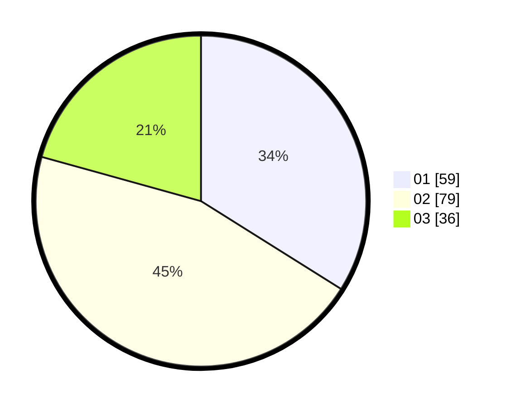

# Hasil

Hasil perolehan suara paslon dapat dilihat pada file paslon-01.txt, paslon-02.txt, dan paslon-03.txt.

Jika tidak ada, artinya data tersebut belum ada pada SIREKAP.

## Perolehan Suara

 * Paslon 01: **59**.
 * Paslon 02: **79**.
 * Paslon 03: **36**.

## Foto C Plano

https://sirekap-obj-formc.kpu.go.id/eb29/pemilu/ppwp/31/75/06/10/07/3175061007142-20240214-185912--fb74a98c-d380-4f82-a551-a6aeca98abc5.jpg

https://sirekap-obj-formc.kpu.go.id/eb29/pemilu/ppwp/31/75/06/10/07/3175061007142-20240214-190142--63d3f247-092f-4321-8fae-7f9a96045547.jpg

https://sirekap-obj-formc.kpu.go.id/eb29/pemilu/ppwp/31/75/06/10/07/3175061007142-20240214-190323--bde452d7-447c-4e36-a287-c514feabc3c1.jpg

## DATA PEMILIH TETAP

Jumlah pemilih dalam DPT: **258**.
 * L: **135**.
 * P: **123**.

## DATA PENGGUNA HAK PILIH

Jumlah pengguna hak pilih dalam DPT: **175**.
 * L: **83**.
 * P: **92**.

Jumlah pengguna hak pilih dalam DPTb: **2**.
 * L: **1**.
 * P: **1**.

Jumlah pengguna hak pilih dalam DPK: **0**.
 * L: **0**.
 * P: **0**.

Jumlah pengguna hak pilih: **177**.
 * L: **84**.
 * P: **93**.

## JUMLAH SUARA SAH DAN TIDAK SAH

JUMLAH SELURUH SUARA SAH: **174**.

JUMLAH SUARA TIDAK SAH: **3**.

JUMLAH SELURUH SUARA SAH DAN SUARA TIDAK SAH: **177**.
