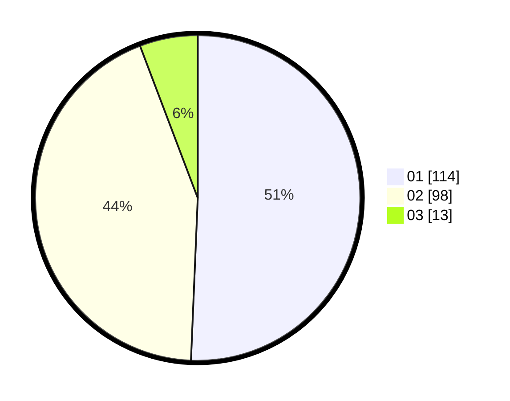

# Hasil

Hasil perolehan suara paslon dapat dilihat pada file paslon-01.txt, paslon-02.txt, dan paslon-03.txt.

Jika tidak ada, artinya data tersebut belum ada pada SIREKAP.

## Perolehan Suara

 * Paslon 01: **114**.
 * Paslon 02: **98**.
 * Paslon 03: **13**.

## Foto C Plano

https://sirekap-obj-formc.kpu.go.id/bb06/pemilu/ppwp/31/75/06/10/07/3175061007148-20240214-232018--0a8e47c6-06d3-40b9-996f-6031a5783762.jpg

https://sirekap-obj-formc.kpu.go.id/bb06/pemilu/ppwp/31/75/06/10/07/3175061007148-20240214-232045--b8bfe612-7567-40f2-b2b9-4837efc7e608.jpg

https://sirekap-obj-formc.kpu.go.id/bb06/pemilu/ppwp/31/75/06/10/07/3175061007148-20240214-232113--4edf7828-8b19-41e4-a5f4-19d21e0df3da.jpg
