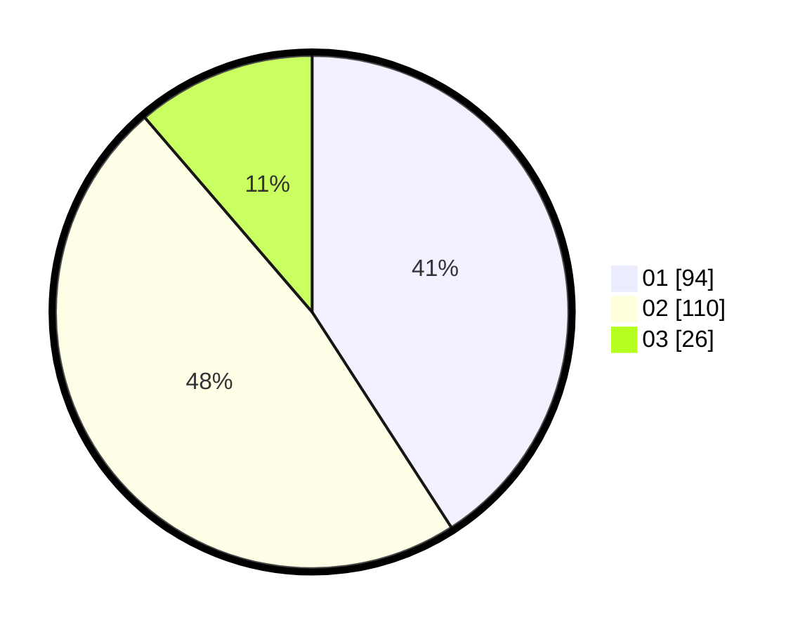

# Hasil

Hasil perolehan suara paslon dapat dilihat pada file paslon-01.txt, paslon-02.txt, dan paslon-03.txt.

Jika tidak ada, artinya data tersebut belum ada pada SIREKAP.

## Perolehan Suara

 * Paslon 01: **94**.
 * Paslon 02: **110**.
 * Paslon 03: **26**.

## Foto C Plano

https://sirekap-obj-formc.kpu.go.id/1cc6/pemilu/ppwp/31/75/06/10/07/3175061007150-20240214-203543--5824160f-b27a-43e6-8d08-f8370f691f61.jpg

https://sirekap-obj-formc.kpu.go.id/1cc6/pemilu/ppwp/31/75/06/10/07/3175061007150-20240214-205016--3e4e73c5-464c-4a64-ba87-a3dd1c03cdac.jpg

https://sirekap-obj-formc.kpu.go.id/1cc6/pemilu/ppwp/31/75/06/10/07/3175061007150-20240214-205215--83c5788e-b402-4d89-8df7-aa5b016f82ed.jpg
