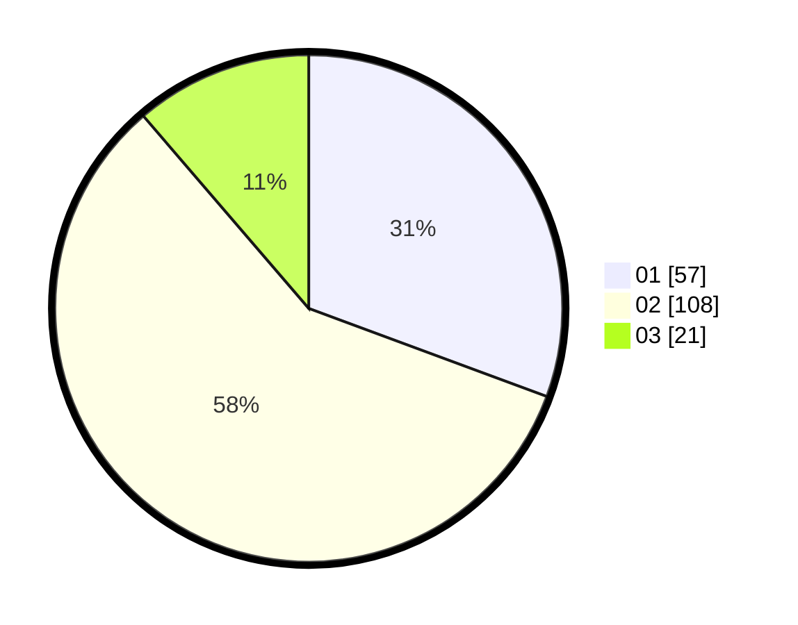

# Hasil

Hasil perolehan suara paslon dapat dilihat pada file paslon-01.txt, paslon-02.txt, dan paslon-03.txt.

Jika tidak ada, artinya data tersebut belum ada pada SIREKAP.

## Perolehan Suara

 * Paslon 01: **57**.
 * Paslon 02: **108**.
 * Paslon 03: **21**.

## Foto C Plano

https://sirekap-obj-formc.kpu.go.id/2062/pemilu/ppwp/31/75/06/10/07/3175061007160-20240214-214255--24fd24a0-f872-48c8-8bf5-38b21d13933d.jpg

https://sirekap-obj-formc.kpu.go.id/2062/pemilu/ppwp/31/75/06/10/07/3175061007160-20240214-214359--13e3010a-3411-4c2f-82f5-8a8161d4112a.jpg

https://sirekap-obj-formc.kpu.go.id/2062/pemilu/ppwp/31/75/06/10/07/3175061007160-20240214-214511--3de01c01-d3a8-49d2-93cd-530650feb0d2.jpg
